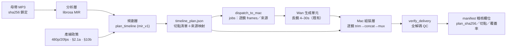

# A 線音樂時間軸產生器（Music Timeline Generator）設計草案 v1

> 2026-09-13 · 依據：盲評結論（v4 §9，B 路勝出 3.2 vs 2.2/2.2）· 供 CEO 審核
> 狀態：**已批核（2026-09-13）**——§9 三項已定案；P1 實作啟動中

---

## 0. 一頁摘要

- **目的**：把盲評勝出的 **B 邏輯**（節拍／onset 對齊＋鏡頭長度隨能量呼吸）產品化，讓所有 A 線 MV 集數從「固定長度直切」升級為「音樂驅動時間軸」。
- **邊界**：**生成層（Wan 長鏡）完全不動**；只新增**編輯層規劃器**——產出 `timeline_plan.json`，由既有組裝層執行逐鏡裁切與拼接。
- **不變的護欄**：480p／20fps、母帶唯一主軌（§10b）、基底＋變體（§2.1a）、零對白、全解碼 QC、母帶 sha256 鎖定。
- **成本**：零新增生成成本；P2 試點可直接用**既有已渲染素材**重剪驗證。

---

## 1. 範圍與非範圍

**In scope（v1）**
- 分析層：母帶 → beats／onsets／能量曲線（librosa；已於 `music_pilot` 實戰驗證）
- 規劃層：`plan_timeline()` → 逐鏡切點清單＋來源映射
- 驗證層：plan validator＋組裝後 QC（沿用 `verify_delivery`）
- 整合：PC 派送（dispatch）＋Mac 組裝（worker）＋ manifest 稽核欄位

**Out of scope（v1 不做）**
- 生成參數變更（Wan 單元長度、模型、prompt 生成）
- 特效／轉場自動化（**盲評顯示零加分**；`effect` 欄位保留但恆空）
- VEO／Kling 英雄鏡路由（另行決策）

---

## 2. 盲評依據（為何是 B）

| 面向 | A 現行 | C 加料 | **B 節拍 MIR** |
|---|---|---|---|
| 均分 | 2.2 | 2.2 | **3.2** |

- 訊號：**節拍對齊＝價值來源；特效加料無加分**（C 與 A 同分）。
- 保留意見：片庫僅 2 集 × 9 取樣，絕對分數受素材限制；B 領先 +1.0 為方向訊號 → P4 以多集素材複驗。

---

## 3. 架構總覽



---

## 4. 介面規格（Interface）

### 4.1 模組介面（新檔 `scripts/pipeline/music_timeline.py`）

```python
@dataclass(frozen=True)
class MusicAnalysis:
    sha256: str; duration_sec: float; bpm: float
    beats: list[float]; onsets: list[float]
    rms_times: list[float]; rms: list[float]      # downsample 可
    peak_t: float; calm_t: float

@dataclass(frozen=True)
class ShotSpec:
    index: int; start_sec: float; end_sec: float; frames: int
    source: str            # 來源單元 ID／路徑
    in_offset_sec: float   # 單元內起點（逐鏡裁切）
    effect: str = ""       # v1 恆為 ""

@dataclass(frozen=True)
class TimelinePlan:
    version: str           # "mir_v1"
    master_sha256: str; duration_sec: float
    boundaries: list[float]; shots: list[ShotSpec]
    params: dict; created_utc: str; planner_commit: str

def analyze_master(path: Path, *, sr: int = 22050) -> MusicAnalysis
def plan_timeline(master: Path, duration: float, sources: list[Path],
                  *, style: str = "mir_v1", seed: int | None = None) -> TimelinePlan
def validate_plan(plan: TimelinePlan, *, fps: float = 20.0, min_gap: float = 0.8,
                  source_pool: list[Path]) -> list[str]   # 回傳錯誤清單；空＝通過
```

### 4.2 CLI

```powershell
venv\Scripts\python.exe scripts\pipeline\music_timeline.py `
  --master "Y:\AI_Drama_Factory\assets\audio\ceo_approved_beats\lofi\<track>.mp3" `
  --duration 175 --style mir_v1 --seed 123 `
  --sources "Y:\AI_Drama_Factory\Auto_Drama\output\handoff\done\<episode>\v01.mp4" `
  --out plan.json
```

退出碼 0＝通過、1＝驗證失敗（零靜默）。

### 4.3 Job JSON 擴充（dispatch → Mac；向後相容）

```json
"timeline": {
  "plan_sha256": "…",
  "fps": 20,
  "shots": [
    {"shot_number": 1, "start_sec": 0.0, "end_sec": 3.05,
     "source_unit": "sh001_u01", "in_offset_sec": 0.0, "frames": 61}
  ]
}
```

缺省 `timeline` ＝ 現行固定行為（不影響存量流程）。

### 4.4 Manifest 稽核欄位（每集）

`timeline_plan_sha256`、`boundary_list`、`native_coverage_pct`、`source_use_count`、`variant_list`（§2.1a）、`bpm`、`style`。

---

## 5. 演算法（mir_v1 定稿參數）

- 目標鏡長：`L = clamp(3.4 − 1.0×E_norm, 1.6, 3.4)` 秒（高能量→短鏡；**下限 1.6s 常態** —— CEO 定案 2026-09-13）
- 邊界：吸附最近 **beat**（容差 0.18s）；無 beat 時吸附 **onset**（容差 0.25s）；相鄰切點最小間距 = 1.6s（即鏡長下限）
- 來源映射：輪轉採樣池、去相鄰同源；各來源使用計數寫入 manifest
- 收尾：尾切點強制＝曲長；不足幀以末鏡延長（不補幀、不變速）
- 全部參數落 `params` 欄（可調、可複驗）

> `music_pilot` 已用等價邏輯產出 30s 三軌並通過 QC（30.000s／480x848／20fps）——本節即其形式化。

---

## 6. 整合點（Integration Points）

| # | 位置 | 變更 | 護欄 |
|---|---|---|---|
| I1 | `scripts/pipeline/music_timeline.py`（新） | 分析＋規劃＋驗證 | 純離線、可單測 |
| I2 | `music_pilot.py` | 重構為呼叫共用分析層（同源） | 行為等價測試 |
| I3 | `dispatch_to_mac.py` | 新增 `--timeline-plan`（可選）；`build_job` 讀 timeline block | 缺省＝現行行為 |
| I4 | `mac_wan_worker.py` | 支援逐鏡 trim（`in_offset_sec`）＋依 timeline 排序 | plan sha 驗證；既有 QC 全保留 |
| I5 | manifest／schema | 稽核欄位（§4.4） | 加欄向後相容 |
| I6 | 測試 | planner／validator／守門（§2.1a 計數）新測 | CI 鉤子基線提升 |

---

## 7. 遷移計畫（4 階段）

| 階段 | 內容 | 產出／驗收 | 估時 |
|---|---|---|---|
| **P1** 離線規劃器 | 模組＋CLI＋validator＋單測；既有母帶 dry-run | `plan.json` 供審；validator 0 error | 0.5 天 |
| **P2** 單集試點 | **既有已渲染素材**重剪（零生成成本）；與現行成片並排 | 30–60s 並排樣片 → CEO 覆核 | 0.5–1 天 |
| **P3** 產線接線 | **逐集 opt-in**（CEO 定案 2026-09-13；非預設啟用）；回滾開關 `--style fixed` | 全鏈跑通＋manifest 稽核欄位 | 1 天 |
| **P4** 複驗調參 | 素材 ≥6 集後盲評複驗；params 調校 | 複驗報告 | 條件觸發 |

風險與對策：
- beats 缺失 → 自動降級 onset；librosa 版本漂移 → 版本鎖定（VERSION.lock 慣例）
- 素材不足 → 允許同源跳切（jump-cut，MV 慣用手法）並計入變體清單
- 回滾：`--style fixed` 即回復現行行為（零殘留）

---

## 8. 驗收標準（Gate）

- plan validator 0 error；組裝 QC 全綠（h264／480x848／20fps／AAC48k／全解碼）
- 切點誤差 ≤ 0.05s（1 幀）；相鄰同源 = 0；來源使用計數符合 §2.1a 解讀（見 §9-Q1）
- 原生覆蓋率 ≥ 60%；A/B 並排覆核不低於現行

---

## 9. 開放問題——**已定案（CEO 2026-09-13）**

1. **§2.1a 解讀（定案）**：同一（來源, 起點, 終點）組合的**重播**才算一次重現；同一長鏡之**不重疊唯一時間段**屬原生使用；來源使用計數全數寫入 manifest 供稽核。（修正 §2.1a 之公文解讀依據）
2. **短鏡下限（定案）**：**1.6s 常態**（能量曲線全域皆適用）。
3. **P3 模式（定案）**：**逐集 opt-in**（非預設啟用）。

---

## 10. 新參考的後續提案（未併入已核准 v1）

CEO 新增 Aura Bloom 三支參考後，依公開封面、完整說明與 Veo 3.1 官方文件整理了 [奇幻美術、療癒慢鏡與 Veo 製作方案](世界級架構與雙線影像策略_v3.md#9-aura-bloom-新參考與-veo-31-製作提案)。影片未能成功播放，方案中的鏡長為試驗建議，不是原片量測結果。

建議另行比較 `ambient_cinematic` 的 4–8 秒停留與樂句換景，並研究核准首幀 → Veo 外部素材 → 時間軸的薄轉接方式。這是 **v1 以外、待 CEO 核准的延伸**，不變更 §5 已定案參數、1.6 秒下限、逐集 opt-in 或「生成層不動」邊界。Veo 原生至少 720p／24fps，不能宣稱目前 480p／20fps 生成政策已涵蓋它；需先核准來源規格例外及費用。

**2026-09-13 CEO 核准**：療癒慢鏡先以 0 成本重剪盲評立項（D1-D3 不變）；720p/24fps 生成源逐案例外；小樣預算 ≤US$20；本地對照組強制前置；lofi 臉部特寫放行（light_music 仍零人物）。實作狀態：`ambient_cinematic` 樣式已進入 `music_timeline.py`（`STYLE_PRESETS`；validator 依 `plan.params` 檢核）。

**盲評 2 複驗（2026-09-13，療癒慢鏡三軌，CEO 評分完成）**：track_1 現行 fixed **12** ＞ track_2 mir_v1 10 ＞ track_3 `ambient_cinematic` 9（解答 `CEO/03_樣片與交付/盲評2_療癒慢鏡_解答.json`）。本批素材上 mir_v1／ambient 樣式**未勝出** → §5 已定案參數、1.6s 下限、P3 逐集 opt-in **全部不變**；`ambient_cinematic` 保留為可選樣式（`STYLE_PRESETS`）。樣式選擇改以**素材形態**為判據（療癒長鏡素材 → fixed；短拍快切素材 → mir_v1），列入下一輪多集素材盲評比較項；GO 條件：GATE 0（VEO 水印預檢）＋本地對照強制前置不變。
