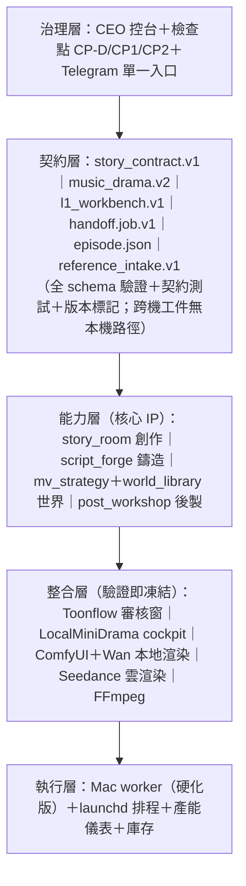

# 世界級架構改善提案（v1）— CEO 架構檢視交付

**日期**：2026-09-12
**交付對象**：CEO
**範圍**：`F:\AI_DRAMA_FACTORY`（PC 控制面）＋ `Y:\AI_Drama_Factory`（Mac 執行面）
**方法**：五路平行唯讀盤點（故事室／鑄造、跨機管線／基建、開源整合層、A 線生產／素材 intake、舊系統／支援層），全量涵蓋 **205 支 Python 檔、40,738 行自建碼**，並抽樣核對雙機一致性（sha256）。全程未修改任何產線檔案。

> **閱讀指引**：只看第 0 節＝五分鐘掌握全局；決策者再讀第 2、3、5 節；工程細節見第 3 節清單與附錄。

---

## 0. 執行摘要

### 0.1 系統現狀（一句話）

一條**已跑通的雙機 AI 製片廠**：PC 控制面負責劇本／世界／派送（40.7k 行自建碼），Mac 執行面負責渲染／後製／上傳（24/7）；三條生產線（light_music／lofi MV、AI_Drama 劇情）共用同一契約層與 CEO 檢查點。

### 0.2 三個關鍵發現（誠實）

**① 產能：可行但緊，且尚無儀表**
- 實測：480p、20 步標準下，30 秒長鏡（6 生成單元）≈ 3.4 小時；一集 175s（6 鏡）≈ **20 小時**（2026-09-12 樣片實跑，ETA 三方吻合）。
- 三頻道「每週各 1 集」≈ 60 小時／週 ≈ Mac 週時間的 **36%**——數學上可行；但加上失敗重試與後製後，實際佔用恐達 **50–70%**；B 線量產（56 集 × 20h ≈ 1,120h ≈ 47 天）必須與 A 線**錯峰排程**。
- 缺口：**無產能儀表**（每單元實測時間、失敗率、ETA 皆不落庫）；**變體剪輯（CEO 已授權 §2.1a）尚未落實到 dispatch/worker**——實測同一鏡 6 個單元共用同一 seed，若模型具決定性則 6 段內容全同：這既是 **6 倍 GPU 浪費**，也與「重現需可見變體」原則牴觸。

**② 可靠性：核心已穩、邊緣脆弱**
- 已穩：FFmpeg 廣播級工序、vault DB、契約轉接器、CEO 控台同步、PC 側 76+ 項測試。
- 脆弱（實證）：**最高風險元件 Mac worker 零測試**；快取重用只驗檔案大小（截斷檔可被當「完成品」重用）；母帶 sha256 欄位從不驗證（靜音成片仍進 `done/`）；**部分 LLM 通道無重試**（`llm_text`——鑄造日誌實測多次「empty content」直接降級）；評審呼叫失敗可產生**假 7.5 分**並具備王者資格。

**③ 治理：標竿與落後並存**
- 標竿：**Toonflow 整合治理**（tag＋commit＋sha256 版本鎖、契約測試、六步升級 playbook、autoconfig）——這是「驗證即凍結」的現成模板。
- 落後：**LocalMiniDrama 已被 7+ 檔本地補丁**卻無版本鎖、無補丁台帳（「上游原封」敘述與事實不符）；**`scripts/pipeline/` 未納版控**（部署靠手動複製）；Telegram **五套入口**並存；**CP-D「Approve→入庫」未閉環**（素材→生產唯一硬斷層）；`l1_workbench`（鑄造落版）**無消費者**。

### 0.3 CEO 理念工程化：「驗證即凍結」原則（Pin-once-Validated）

> **引用開源 → 契約測試驗證成功 → 建 `VERSION.lock`（含補丁台帳）→ 凍結。升級與否由「我方系統需求」驅動，不追隨上游更新節奏。**

- **三分法**：整機引用（Toonflow／LocalMiniDrama）／組件引用（FFmpeg／ComfyUI／函式庫）／概念借鑑（OpenWrite 六域／CrewAI 對抗）——各有不同的治理義務（見 §2.1）。
- **升級觸發條件**（三者之一才啟動評估）：我方需要新功能／安全修補／契約測試失敗；評估必跑契約測試＋沙盒。
- **新功能決策樹**：上游已有？→ 建適配器；開源有已驗證方案？→ 鎖定引用；僅業務特有？→ 自建（最小化，且於 §3.7 對照表登記「上游為何不堪用」）。

### 0.4 三階段路線（詳 §5）

| 階段 | 主題 | 內容 |
|---|---|---|
| **30 天** | 止血／硬化 | P0 全修＋worker 硬化＋LLM 退避＋版控補齊＋Telegram 收斂 |
| **90 天** | 閉環／儀表 | CP-D 閉環、`l1_workbench.v1` 契約＋LMD 消費、產能儀表、LMD 治理補齊 |
| **季度** | 世界級 | 採納審計、B 線 `episode.json`＋Script Lock、post_workshop 歸位 Mac、季度升級窗口 |

---

## 1. 系統全貌

### 1.1 規模（實測）

| 面向 | 實測值 |
|---|---|
| 自建碼 | **205 支 py、40,738 行**（F:，不含 venv／node_modules／第三方 clone） |
| 雙機 | PC 控制面（可關機）↔ Mac mini M4 24/7（`Y:` ＝ Mac SMB 共享） |
| 最大模組 | `pipeline_runner` 89KB、`ui/backend` 79KB、`suno_api_engine` 62KB、`multi_scene_processor` 62KB、`lofi_assembler` 61KB、`script_forge` 57KB |
| 測試 | PC 76+ 項；**Mac worker 0 項；post_workshop 0 項**（最高風險兩區） |
| 開源 clone | `LocalMiniDrama-main`（MIT v1.2.8）、`integrations/toonflow`（Apache-2.0 v1.1.8）、`Y: integrations/comfyui`（完整 clone） |

### 1.2 五大子系統一覽

| 子系統 | 核心元件 | 狀態 | 關鍵判讀 |
|---|---|---|---|
| **故事室＋鑄造** | `story_room`（~3.7k 行）、`script_forge`（1,097 行） | **活躍** | 自建核心 IP；鑄造 v2.1 軟累積生效（王者 7.21→7.37→**7.61**，iter 127、零 error）；修復清單見 §3 |
| **跨機管線＋基建** | `dispatch`（239 行）、`mac_wan_worker`（585 行）、`scripts/common`（~2.4k 行） | **活躍、worker 脆弱** | 契約設計良好（handoff.job.v1）；韌性缺口集中於 worker；已驗證事故修復在碼內 |
| **開源整合層** | Toonflow、LocalMiniDrama、ComfyUI＋Wan 2.1 | **混** | Toonflow＝標竿；LMD＝待補治理；詳 §2 |
| **A 線＋素材 intake** | `post_workshop`、`reference_intake`（~1.6k 行） | **半** | CP-D 閉環斷點（唯一硬斷層）；post_workshop 未歸位 Mac（違反 §2.4） |
| **舊系統／支援層** | gear1_prod／gear2_rnd／ui／streaming_steam | **凍結／死** | 清理清單見 §3-P2；挖礦線 13 死檔、五套 Telegram 入口 |

### 1.3 開源引用清單（治理狀態）

| 開源系統 | 版本／授權 | 引用方式 | 治理狀態 | 判定 |
|---|---|---|---|---|
| **Toonflow-app** | v1.1.8／Apache-2.0（+補充條款） | 整機（Docker 外部系統＋適配器） | ✅ **標竿**：VERSION.lock（tag+commit+sha256）、契約測試、六步升級 playbook、autoconfig、授權備註 | 保持；fixture 待刷新 |
| **LocalMiniDrama** | v1.2.8／MIT | 整機（HTTP API，艙內 UI） | ⚠️ **弱**：無版本鎖、非 git checkout、**7+ 檔本地補丁無台帳** | 補治理：VERSION.lock＋補丁 overlay 化 |
| **ComfyUI＋Wan 2.1** | 未鎖 | 整機（Mac :8188 渲染引擎） | ⚠️ 部分：Y: 有 clone；版本／模型指紋未鎖 | 補 commit＋模型 sha256 |
| **FFmpeg** | 系統安裝 | 組件（組裝/混音/字幕全工序） | ✅ 廣播級工序已內化為鐵律（§7） | 保持 |
| **gcui-art/suno-api** | — | 組件（已退役） | ❌ 死碼殘留（啟動器指向不存在路徑） | 清理（§3-P2） |
| **OpenWrite 六域＋review DAG** | — | 概念借鑑（`critic_dims.py` 自述） | ✅ 借概念未複製碼 | 保持（來源標註齊） |
| **CrewAI 對抗迴圈** | — | 概念借鑑（`agents.py`） | ✅ 借概念 | 保持 |
| **函式庫**（Streamlit、python-telegram-bot、playwright、openai SDK 等） | requirements 部分 `==` 部分 `>=` | 組件引用 | ⚠️ 未全鎖（無 lock 檔） | 全鎖定＋季度升級窗口 |

---

## 2. 與開源系統的對照分析

### 2.1 引用層次三分法與治理義務

| 層次 | 定義 | 治理義務 | 現況 |
|---|---|---|---|
| **整機引用** | 用別人的完整系統跑一整個環節 | 版本鎖（tag+commit+sha256）＋補丁台帳＋契約測試＋升級 playbook＋授權標註 | Toonflow ✅／LMD ⚠️／ComfyUI ⚠️ |
| **組件引用** | 用成熟函式庫／工具做通用能力 | 鎖定相依版本（requirements `==`）＋季度升級窗口＋不修改原始碼 | 部分鎖定 |
| **概念借鑑** | 只借設計思想、自寫實作 | 來源標註即可；不追蹤上游 | ✅ 已標註 |

### 2.2 治理成熟度矩陣（結論）

**Toonflow 模式（唯一完整）**：VERSION.lock 記錄 tag→commit 釘死＋installer sha256＋「禁止自動更新」明文＋手動升級六步 playbook（讀 release notes→改 lock→刷新 fixture→跑契約測試→重建容器→更新文件）＋授權條款註記——**這正是 CEO「驗證即凍結」理念的現成模板，應複製到所有整機引用**。

**LocalMiniDrama（最大治理缺口）**：已在 `videoClient.js`、`videoService.js`、`videoMergeService.js`、`mergedEpisodePostProcess.js`、`narrationVideoPostProcess.js`、`omniReferencePlan.js`、`storyboards.js` 等 **7+ 檔留下我方補丁**（CEO 授權的 Seedance 2.5 補丁、MV 關音、fps/音訊規範、字幕字體等），但：
1. 無 `VERSION.lock`（v1.2.8 僅能靠 README/CHANGELOG 佐證）；
2. 補丁無台帳（無「檔案×授權依據×日期」記錄）；
3. 非版控資料夾 → 補丁不可重建、上游升級不可對帳。
**建議**：比照 Toonflow 補齊（詳 §5），並把補丁 overlay 化（如 `Dockerfile.hostport` 模式），讓「上游 v1.2.8＋我方 overlay」成為可重建的明確組合。

### 2.3 自建邊界判準（哪些自建是正確的）

**自建合理（開源不存在或業務太特殊——核心 IP，保持）**：
`story_room`（世界／鉤子／反轉引擎）、`script_forge`（L1–L4 鑄造閘門協定）、`mv_strategy`（世界即主角）、`world_library`（動態成長＋novelty 閘）、`dispatch/handoff` 契約、CEO 控台。——這些共同構成本系統的**差異化護城河**，迭代證據鏈（逐輪 log）在業界獨一無二。

**自建但應標準化（向「內部已驗證模組」看齊——最快槓桿）**：
本系統存在**已試誤成熟的內部模組**，但子系統各自為政、未複用：
- `llm_client` 有指數退避＋多引擎回退＋持久化佇列，但 `llm_text` 另寫簡版**無任何重試**（實測受害）；
- `json_parser_utils` 有字串感知四層清洗（強於外部 reference 實作），但 `script_forge` 另寫 `_salvage_json`（互補可合流）；
- `_write_json` 有 SMB 原子寫＋重試，但 `world_library.commit`、manifest 等處仍直接 `write_text`。
**建議**：將這些成熟模組視同「內部開源」——統一為單一入口，全面複用，禁止再寫簡版。

**應停用／刪除的自建**：挖礦線 13 檔、五套 Telegram 其中的四套、兩套 Seedance 接線（選一）、根目錄殘留腳本、死啟動器（§3-P2）。

### 2.4 已達世界級的部分（誠實盤點，保持）

1. **CEO 檢查點制度**（CP-D／CP1／CP2＋fail-fast 由廉到貴）——治理設計領先同業；
2. **契約思維**（`story_contract.v1`、`music_drama.v2`、`handoff.job.v1`、`reference_intake.v1`）；
3. **廣播級 FFmpeg 鐵律**（fps／取樣率／字體／浮水印紅線）；
4. **鑄造引擎的迭代證據鏈**（≥15 輪逐迭代 log 為閘門證據——可審計的 AI 劇本品質流程）；
5. **Toonflow 治理模式**（版本鎖＋契約測試＋升級 playbook）；
6. **世界庫新穎度硬閘**（novelty ≥0.25、`_balanced_pick` 頻道平衡 RCA 修復）。

---

## 3. 誠實問題清單（按嚴重度）

### 3.1 P0 阻斷級（原 5 項 → 1 已修復、1 實測撤回、3 待批）

| # | 問題 | 證據 | 影響 | 修法 |
|---|---|---|---|---|
| P0-1 | `selfcheck.py` 語法錯誤（縮排 8 vs 4 空格） | **✅ 已修復**：py_compile 實證 IndentationError（L51）→ 修正 → selfcheck **11/11 PASS**、全套測試 101 passed | ~~「一鍵驗收」失效~~ 已恢復 | ✅ 2026-09-12 完成（驗證見附錄 B） |
| P0-2 | **CP-D 審核閉環斷點**（Approve→commit 無 handler） | `world_proposal.py` L466 僅模板文字；`world_library.commit` 無任一流程調用 | 素材→生產**唯一硬斷層**；W37 四座草案無法入庫進 MV 題材池 | 新增審核回覆 handler → `commit()`（含 novelty 閘與重複拒絕訊息） |
| P0-3 | ~~`weekly_intake.py` pack 路徑 bug~~ **撤回（實測非 bug）** | 路徑算術實測：`week_dir().parent.parent/"cp_d"` ≡ `CP_D_ROOT`（皆為 `reference_intake/cp_d`） | —（原指稱不成立，保留記錄供審計） | — |
| P0-4 | **Mac worker 零測試**（最高風險元件） | `tests/` 僅 dispatch 路徑測試 | 靜默品質事故風險（曾發生靜音交付事故）；回歸無防護 | 假 ComfyUI 端到端測試（claim／recover／重用／failed／母帶缺失五路徑） |
| P0-5 | `llm_text` 無重試（429/空回應直接降級） | `llm_text.py` L58–80 無退避；鑄造日誌實測多次「DeepSeek returned empty content」 | 鑄造輪降級、假分風險；品質滑落不可控 | 加指數退避≤3 次（比照 `llm_client` 模式與 §3.2 Seedance 規範） |

### 3.2 P1 韌性／品質級（14）

| # | 問題 | 證據 | 修法 |
|---|---|---|---|
| P1-1 | 快取重用只驗 `st_size > 0`（截斷檔當完成品重用） | `mac_wan_worker.py` L371 | `.part` → ffprobe（尺寸＋時長＋可解碼）→ `os.replace`；重用路徑同樣 probe |
| P1-2 | 母帶 sha256 從不驗證；靜音成片仍進 `done/` | L427–437（只記 findings＋pass=false） | mux 前後驗 `music.sha256`；母帶缺失改入 `failed/`（或暫存區），status 記 `audio.verified` |
| P1-3 | one-shot 可搶 job（`_recover_stale` 無 owner 檢查） | L290–311 | 守衛擴至 `--once/--job`＋lockfile/PID 檔（消 TOCTOU） |
| P1-4 | 同鏡 6 單元同 seed（6 倍 GPU 浪費＋違反變體原則） | dispatch L133–137 只寫 index/duration | per-unit 變體 seed＋manifest `variation_plan`（回應 §2.1a 可稽核） |
| P1-5 | 無心跳／進度／完成通知 | worker 僅結束時一份 status.json | `processing/<job>.json` 週期更新 `{progress, updated_at, pid}`＋Telegram 通知（HTML parse_mode） |
| P1-6 | Y: 路徑硬編碼三處；未用 `env_manager` | dispatch L36、run_mv_pipeline L39、ceo_console L39 | 統一改 `env_manager.config.smb_*` |
| P1-7 | Telegram 五套入口＋`parse_mode` 違規＋死 handler | `telegram_bot_manager.py` 多處 Markdown（§6.1 禁）；`confirm_reset`／`back_to_menu` 死路 | 收斂單一入口；全改 HTML；清死路 |
| P1-8 | 評分雙軌（`_PENALTY` vs `critic_dims._score_from` 係數無換算） | `script_forge.py` L64 vs `critic_dims.py` L11–14 | 合流單一 `penalty()`＋`SCORING_VERSION` 入 `run_meta.json` |
| P1-9 | 假 7.5 分可成王者（degraded 標記缺失） | `script_forge.py` L873–877 | 失敗輪標 `degraded:true`，王者條件排除；`run_meta` 記 `judge_model` |
| P1-10 | `_apply_patch` 排序漏洞（僅新增集才重排） | L670–672 | 任何 `episode_patches` 後均 `sort by int(ep)`；`rule_findings` 加 ep 遞增檢核 |
| P1-11 | `stock_search` manifest append 不去重 | L329–330 | 改以 `provider+id`／sha256 upsert |
| P1-12 | vision／圖庫鏈無退避（429 直接跳過） | `world_proposal`／`stock_search` | 簡易指數退避（與 §3.2 精神一致） |
| P1-13 | `post_workshop` 僅存在 PC、無產線調用（違反 §2.4 後製在 Mac） | Mac 端 `MAC_PW_MISSING` | 同步 Mac＋接 handoff `done/` 自動後製鏈（QC FAIL 阻斷上架） |
| P1-14 | 失敗可見性缺口（`failed/*.json` 舊格式不匹配 status 讀取） | `run_mv_pipeline` L167–171 glob 不中 | 統一 `failed/<job>/status.json` 格式；保留 manifest 副本可原地重派 |

### 3.3 P2 清潔／治理級（10）

| # | 問題 | 修法 |
|---|---|---|
| P2-1 | **`scripts/pipeline/` 未納 git**（含 plist 未版控） | 全數納入＋`launchd/` 範本＋部署 sha256 比對 |
| P2-2 | LMD 補丁無台帳、無 VERSION.lock | 建 `integrations/localminidrama/VERSION.lock`＋補丁清單＋升級 playbook |
| P2-3 | Toonflow fixture 仍 PROVISIONAL | 一次真實導出後刷新＋契約重測 |
| P2-4 | 挖礦線死碼 13 檔＋`start_mining.bat`＋`style_vault.db` | 刪除（零風險最大減量） |
| P2-5 | 根目錄 11 個 `_*.py` 殘留（違反 §11） | 清理＋CI 加「`_*.py` 不得進根目錄」檢查 |
| P2-6 | 壞啟動器（`start_suno_api.bat`、`start_docker_suno.ps1` 等指向不存在路徑） | 修指向或標「已退役」刪除 |
| P2-7 | `ci_cd_verify_v15.10*` 期待不存在的 `.deprecated` 資料夾（測試今必 FAIL） | 修測試或移除該期待 |
| P2-8 | 路徑大小寫不一致（`AI_DRAMA_FACTORY` vs `AI_Drama_Factory`） | 統一 `AI_Drama_Factory`（2 plist＋install 腳本＋文件） |
| P2-9 | `factory_heartbeat` 宣稱常駐但無部署證據；`.openclaw/project.yml` 任務與實作不符 | 決策去留並修正設定檔 |
| P2-10 | `l1_workbench` 無消費者（鑄造落版無人讀） | 建 `converters/localminidrama_import.py`＋LMD cockpit 消費（§5） |

---

## 4. 世界級目標架構（重新思考）

### 4.1 五層架構

**各層「世界級」標準**：
- 契約層：100% schema 驗證＋契約測試入 CI；跨機工件內無 `F:` 路徑（已有規範，需全覆蓋）。
- 能力層：離線可測（offline 模式已有）、每模組驗收工具（selfcheck 修復後回歸）、迭代證據不可竄改。
- 整合層：`VERSION.lock` 100% 覆蓋（含 LMD/ComfyUI）＋升級 playbook 100% 覆蓋。
- 執行層：零靜默失敗（結果驗證閘門）＋心跳／進度／通知＋斷點續跑（已具備）＋產能儀表。
- 治理層：里程碑自動通知、CEO 單一入口、零髒資料進入 CEO 視野。

### 4.2 產能工程（20h／集經濟學）

**現狀模型**：1 集 175s＝6 鏡×30s；1 鏡＝6 生成單元；實測 20h／集（含模型載入；一次過關）。
**需求**：3 頻道每週各 1 集＝60h／週（36% 佔用）——可行；但 B 線量產須錯峰，且要壓低失敗重試。

**改善槓桿（依投報率排序）**：
1. **變體剪輯落實**（CEO 已授權 §2.1a）：生成 1 單元、以可見變體重現 ≤3 次 → 原生生成量可降 ~40–60% → 集成本降至 8–12h；
2. **per-unit 變體 seed**（P1-4）：消除「同鏡 6 段全同」的無效生成；
3. **產能儀表**：每單元實測時間、失敗率、ETA 落庫（`work/<job>/metrics.json`）→ 排程以數據決策；樣本足夠後評估第二台 Mac／雲 GPU 分流；
4. **排程錯峰**：B 線量產窗與 A 線週更錯開（CEO 對 B 線已有「每週三＋六」窗口與「每頻道每週 2 話」的規劃）。

### 4.3 可靠性工程（三道驗證閘門＋測試金字塔）

**三道驗證閘門**（跨機工件通用）：
1. **寫入前**：schema 驗證（契約層）；
2. **寫入時**：原子寫（`.tmp`→`fsync`→`os.replace`＋SMB 重試——`_write_json` 模式推廣全用）；
3. **寫入後**：讀回驗證（ffprobe／sha256／JSON 再解析）。

**測試金字塔補強**（缺口集中在最該防護處）：
- 單元：`qc.verify`／`loudness`／`thumbs.grid`／`_apply_patch`／`salvage`（部分已有）；
- 整合：**worker 五路徑**（P0-4）＋ dispatch→worker→done 全鏈；
- 契約：`l1_workbench.v1`（新）＋ handoff.job.v1 ＋ Toonflow fixture（刷新後）；
- E2E：離線 dry-run 全鏈（已有雛形）。

---

## 5. 改善路線圖

### 30 天（止血／硬化）
1. P0 全修（selfcheck ✅ 已修復／CP-D 閉環雛形／worker 測試／LLM 退避）；
2. Worker 硬化（P1-1～P1-5）；
3. 版控補齊（P2-1 pipeline＋plist）＋根目錄清理（P2-4～P2-6）；
4. Telegram 收斂（P1-7）＋假分防護（P1-9）。

### 90 天（閉環／儀表）
5. `l1_workbench.v1` 契約＋`localminidrama_import.py`＋LMD cockpit 消費（P2-10 路線圖 #1）；
6. CP-D Approve→commit 正式閉環＋回推通知（P0-2 完成）；
7. 產能儀表＋變體剪輯落實（§4.2 槓桿 1-3）；
8. LMD 治理補齊（P2-2）＋ComfyUI 版本／模型鎖；Toonflow fixture 刷新（P2-3）。

### 季度（世界級）
9. 上游採納審計（§3.7 既定制度）首次執行；
10. B 線 `episode.json` 階段機＋Script Lock（§12 待辦 #2）；
11. `post_workshop` 歸位 Mac＋接自動後製鏈（P1-13）；
12. 季度升級窗口（整機引用評估＋組件依賴更新）。

---

## 6. 立即建議行動（Top 5）

| 序 | 行動 | 成本 | 價值 |
|---|---|---|---|
| 1 | `selfcheck.py` 語法修復（✅ 已完成，11/11 PASS） | ✅ | 驗收工具已恢復；其餘 4 項待核示 |
| 2 | `llm_text` 加指數退避＋假分排除 | 小時級 | 鑄造品質立即受益（正在爬坡） |
| 3 | Worker 硬化第一包（原子寫＋probe 重用＋母帶驗證） | 天級 | 封堵最大品質事故面 |
| 4 | `scripts/pipeline` 納版控＋根目錄清理 | 小時級 | 治理底線回歸（§11） |
| 5 | LMD `VERSION.lock`＋補丁台帳 | 天級 | 「驗證即凍結」原則落地第一例 |

> **建議由 CEO 核示順序後即刻執行**；本提案不含任何產線變更，所有項目可獨立驗收。

---

## 附錄 A：測試覆蓋現況（實測）

| 區域 | 覆蓋 | 缺口 |
|---|---|---|
| script_forge | 13 項 | 假分情境（P1-9） |
| world_library／world_proposal | 14 項 | — |
| reference_intake 規劃層 | 19 項 | 下載／manifest merge 層 0 |
| dispatch | 2 項 | — |
| **mac_wan_worker** | **0** | 全部（P0-4） |
| **post_workshop** | **0** | 全部（P1-13） |
| weekly_intake | 0 | 建議補（原報路徑 bug 已實測撤回） |
| telegram 系 | 0 | — |

## 附錄 B：盤點方法與證據索引

- 五路盤點均為唯讀（檔案讀取＋grep＋Pylance 語法檢查），未執行 pytest、未修改檔案；
- 雙機一致性抽查：`mac_wan_worker.py` F:↔Y: sha256 相同；`stock_search.py`／`world_proposal.py`／`weekly_intake.py` PC↔Mac sha256 相同；
- 產線快照（2026-09-12）：鑄造 iter 127、王者 μ7.61／零 error（爬升中）；樣片 job `20260912T115959` sh001 完成（3.36h，ETA 09-13 08:00）；CP-D W37 四座草案待 CEO 審核。

**交付前實測核對（2026-09-12，本日）**：
1. ✅ `selfcheck.py`：實證語法錯誤（L51）→ 修復 → **11/11 PASS**；全套 pytest **101 passed / 1 skipped**。
2. 🔁 **撤回 P0-3**：路徑算術實測 `week_dir().parent.parent/"cp_d"` ≡ `CP_D_ROOT`（同為 `assets/reference_intake/cp_d`）——原「幂等失效」指稱不成立。
3. ✅ 逐項 grep 實證其餘關鍵指稱：`llm_text` 無重試（0 命中）；worker 無 sha256 驗證（0 命中）；`stock_search` manifest append（L335）；`failed/*/status.json` glob（L184）；`parse_mode="Markdown"`×8；`world_library.commit` 零調用（僅註釋）；tests 無 worker 覆蓋；`scripts/pipeline/` 未納 git（`??` 實證）。
