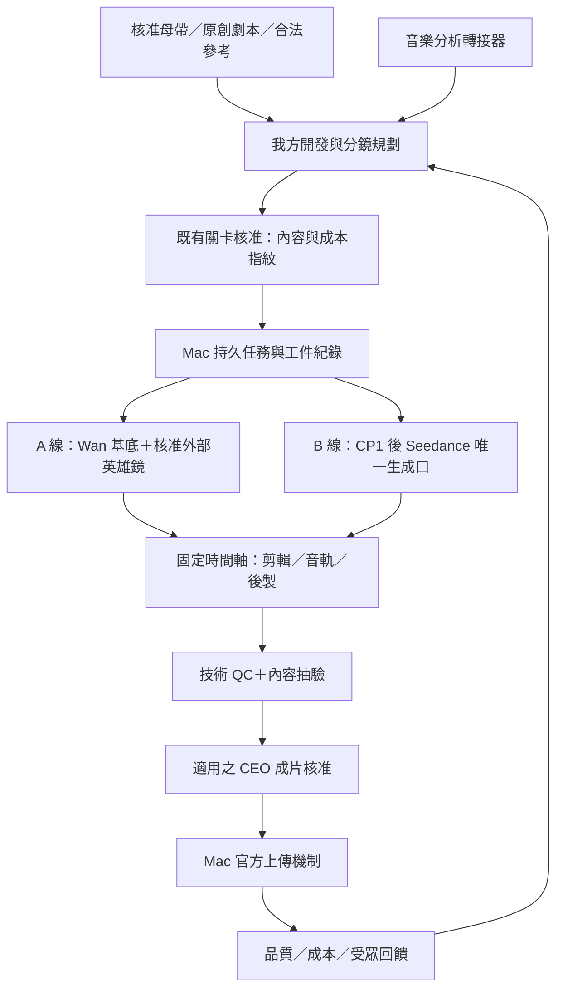

# 世界級架構與雙線影像策略 v3

日期：2026-09-13。性質：CEO 決策提案，未核准、未部署，不取代權威架構、不解除 Seedance 凍結、不修改已核准首集。

後續工程狀態：部分防護已實作並通過雙機隔離驗證，但全部改善尚未達成；交接、原始證據與剩餘工作見 [雙線改善工程驗收與學習手冊.md](雙線改善工程驗收與學習手冊.md)。下文保留提案當時的分析背景。

## 1. 結論與證據邊界

**建議：保留現有三個主要開源系統，先把審核、時間軸、交付驗收做成可信的閉環；從 AutoMV 借音樂理解架構，從成熟剪輯工具借時間軸格式，不再整套疊加另一個自動影片平台。**

目前較準確的定位是「已有多項可用能力的工作室原型」，不是已證明能穩定交付世界級作品的產品。真正差距包括：內容與鏡頭品味、音樂驅動剪輯、跨鏡一致性、實際合格產能，以及可執行而非僅寫在文件中的治理。

本次證據範圍：
- 完整讀取 [架構說明書_v16.1.md](../../架構說明書_v16.1.md)，內文實際版本為 v16.2.10；核對相關規範、前次提案、鎖版檔、派送器、Mac worker、劇本鑄造、B 線 LMD 驅動、後製 QC、審核程式及鄰近測試。
- 雙機遞迴索引：PC 2,487 檔、Mac 3,298 檔，掃描無回報錯誤。排除 Git 物件、node_modules、虛擬環境、Python／一般快取；這是盤點時點的檔案索引，**不是逐檔讀完所有內容，更不是影片、模型權重或全卷資安審計**。未讀取憑證內容，未對正式資料庫寫入。
- 比對七個關鍵部署檔：worker、forge、llm_text、mv_strategy、LMD 鎖檔、ComfyUI 鎖檔六者雙機 SHA-256 相同；Mac 標準位置沒有後製 QC 模組。
- 五組離線測試共 **38 passed，8.44 秒**；另以實際函式和模擬輸入驗證幀數、種子與鑄造閘門。未呼叫付費生成、未部署或發布影片。測試成功不代表真實影片品質已達標。
- 顧問十項建議已查官方專案頁；AutoMV、Vanta 另讀入口／生成轉接程式。未安裝或實跑這些候選系統，效能與研究排名不視為我方實證。
- 四支 YouTube 取得公開標題／頻道；部分取得說明、封面與播放器時長。瀏覽器出現播放錯誤，**未完成逐鏡觀看，也未驗證 BPM、鏡長分布、口型、實際生成工具或製作成本**。以下影片對應方案是設計建議，不是假裝看完後的拆片報告。

### 對前次評估的修正

1. 「Mac 少了其他 story_room 模組，所以沒有 L3 評審團」的推論不成立：本次 forge 主程式雙機一致，四名評審與總導演就在同一檔案內。其他模組仍可能有部署缺口，但不能因此斷言 forge 降級。
2. 「治理已是世界級」過度樂觀。治理方向合理，必須有不可繞過的執行閘門、實際成片驗收與故障恢復證據才能成立。
3. **1,000 次是本專案預算護欄；本次未找到它是通用業界或好萊塢品質標準的證據。** 保留 CEO 現行規則，但不以迭代數代替作品品質。
4. A 線零對白、無可見文字的作品不必強加字幕；需要歌詞字幕或 B 線對白時，才驗證字幕時間與字型。不能一概把 A 線沒有字幕稱為缺陷。
5. 開源公開、README 自述、VERSION.lock 存在，均不等於「成熟、可商用、已驗證投產」。程式碼、模型權重、附屬元件與第三方服務條款須分開確認。

## 2. 應先處理的系統風險

| 優先 | 證據與風險 | 最小改善與驗收 |
|---|---|---|
| P0 | [script_forge.py](../../scripts/story_room/script_forge.py#L1418) 的 gate_check 只檢查核准布林值與迭代數。模擬總分／單域均 1.0、iterations=15 的鎖檔仍回傳 eligible=True。 | 重新驗證門檻、評審非 degraded、真實執行用途、迭代證據、劇本內容指紋；低分、過期、換稿與測試工件必須拒絕。這是函式層缺口，非宣稱已發生正式流程繞過。 |
| P0 | [mac_wan_worker.py](../../scripts/pipeline/mac_wan_worker.py#L334) 不重驗母帶 sha256；缺母帶會交付無聲版本且 pass=False，但 run_job 仍歸入 done。QC 沒有完整驗證音軌、目標時長、浮水印、變體與核准版本。 | 分清 rendered、qc_passed、approved、published；不合格留在明確拒收／草稿狀態。正式交付與發布入口都重驗 hash、用途及 QC，不把 done 目錄當發布授權。 |
| P0 | [telegram_review_bot.py](../../scripts/telegram_review_bot.py#L48) 回呼沒有明確核對核准者；狀態僅存記憶體，後續派工是 TODO。傳送文字訊息，回呼卻使用 edit_message_caption，訊息型態也不一致。 | 授權者 allowlist、持久核准紀錄、內容 hash 綁定、重複回呼冪等；核准後只能進入對應已獲允許的階段，不能任意觸發付費生成。此程式目前是否為正式活動入口仍需服務註冊驗證。 |
| P0 | [mac_wan_worker.py](../../scripts/pipeline/mac_wan_worker.py#L371) 只看既有檔案非空便重用；重啟沒有保存 provider task_id；單實例防護只涵蓋 watch，once／job 也會執行 processing 回收。 | 快取鍵包含模型、workflow、prompt、參考圖與參數 hash；保存任務識別碼、lease、心跳，所有模式共用互斥；失聯先查既有任務，避免盲目重送付費或耗時工作。 |
| P1 | [dispatch_to_mac.py](../../scripts/pipeline/dispatch_to_mac.py#L109) 對同鏡單元沒有不同 prompt 或 seed。實測六個單元取得相同種子；worker 使用獨立 T2V 圖，沒有首尾幀綁定。 | 先在鎖定 JSON 中編譯逐單元意圖、種子及參考圖；重現性保留，但不能把相同生成輸入當成六個獨立鏡頭。相同 seed 不保證每次輸出逐位元相同，也不保證人物一致。 |
| P1 | [mv_strategy.py](../../scripts/story_room/mv_strategy.py#L281) 的 edit_to_sections_and_beats 是政策字串；實際分鏡按固定單元拆分。BASE_VARIATION_POLICY 有常數，檢視的派送／worker 路徑未落實變體清單與覆蓋率驗收。 | 音樂分析結果必須真正決定時間軸；每次變體具來源與轉換紀錄，按來源內容而非檔名計算獨立覆蓋率。 |
| P1 | [lmd_video_chain.py](../../Auto_Drama/auto_drama/lmd_video_chain.py#L264) 在生成階段可再要求 LLM 產生 universal prompt；函式內未見 CP-D／CP1 內容鎖檢查。 | 將提示詞編譯提前至核准之前；生成端只消費鎖定內容。先核對全部活動入口，再決定唯一生成口，不能只依文件宣布舊路已退役。 |
| P1 | [qc.py](../../scripts/post_workshop/qc.py#L34) 的檢查有用，但 Mac 標準部署位置不存在；根層 CI 目前只見備份工作流。 | 發布套件列出必要檔案與指紋、部署後自檢；加入離線契約與政策測試。備份 CI 不等於產線品質 CI。 |

### 時長不是估出來就算交付

實際 `to_wan_frames(5, 20)` 回傳 97 幀，即 4.85 秒。35 個這類單元為 169.75 秒；若實際方案是 36 個單元，則是 174.6 秒，**不能把前者誤報為所有 175 秒方案都少 5.25 秒**。

改善方式是分開「模型原生幀數」與「剪輯目標幀數」：先生成足夠的合法幀數，在 Stage 1 依已核准時間軸裁切、變體與必要編碼，Stage 2 維持 concat demuxer／影像 stream copy。母帶不足、片長不足直接拒收，不用無限循環、靜默截短或凍結尾幀填滿。

### 產能是目前的硬限制

Mac 已完成樣片工作 `20260912T115959_伸展台之夢｜微縮日常`：480x848、20fps、6 鏡共 29.1 秒、耗時 71,445.5 秒，status.pass=True。這是 worker 所記錄的工程完成狀態，**不是 CEO 對視覺品質的核准**。

按這一個樣片近似線性外推：
- 約 19.85 小時產出 29.1 秒，即每小時 1.47 秒。
- 每週兩支 175 秒、全部本機原生生成：約 **238.7 小時／週**，超過 168 小時。
- 僅供應合計 60% 原生時長的理論下界：約 **143.2 小時／週**；若合格可用率為假設的 70%，約 **204.6 小時／週**，尚未計 B 線、後製與維護。單元取整可能再增加時間。
- 因此不能同時無條件承諾「單台 M4、本地全生成、兩頻週更、重試挑片、世界級品質」。這不是完整硬體基準；需再測 3 類鏡頭的 P50/P95、記憶體峰值與可用率。

建議讓 Mac 保持調度與後製宿主，本地 Wan 承擔可預算的環境基底；英雄鏡沿用獲核准的外部引擎。新 GPU 租用／硬體採購先以每秒合格素材總成本比較，不以單次生成價或「零 API 費」判定便宜。

## 3. 顧問十項建議的查證與裁定

**顧問掌握了音樂理解、對位與一致性的方向；但把完整平台、研究模型、剪輯工具和節點集合混排成「全球前十」，沒有共同評測依據。** 對目前 A 線，歌詞、對嘴與跨集角色一致性也不是全部作品的必要條件。

| # | 候選與來源 | 查證結果／限制 | 我方建議 |
|---|---|---|---|
| 1 | [AutoMV](https://github.com/multimodal-art-projection/AutoMV) | Apache-2.0 專案；確有 Demucs、SongFormer、Whisper、Qwen2.5-Omni、導演／編劇／驗證架構。研究為 30 首歌的自家評測，不足以證明全球最強。入口仍指定曲名與外部服務；本地 S2V 說明以 A800 計時。 | **最高優先做局部概念驗證**：音樂分析輸出、音樂段落到鏡頭的規劃、十二面向評估框架。經轉接器進我方 JSON；不採其整套發布、生成路由與無界重生流程。 |
| 2 | [Vanta](https://github.com/itsjwill/vanta) | README 描述 40+ 整合，但 [ai-video.ts](https://github.com/itsjwill/vanta/blob/main/src/integrations/ai-video.ts) 的模型仍是 open-sora／animatediff／allegro，只呼叫通用 generate／animate 端點且沒有檢查 HTTP 狀態。ComfyUI backend、整合測試與部署等仍見於路線圖。 | **不作產線核心**。必要時獨立借用字幕／圖文模板；原始程式碼比宣傳更有決策價值。Remotion 有條件商用授權，不能說全堆疊無條件免費。 |
| 3 | [OpenX Flow](https://github.com/OpenX-Inc/flow) | MIT；有逐場景 API、首尾幀串接與獨立 GPU backend。主定位是旁白式自主影片與自動發布；官方硬體表主要為 CUDA／雲端，不是 Mac 已驗證方案。 | **借逐鏡任務與條件幀契約**；不要再引入第二個總調度器。禁止啟用其 TikTok 或無人審核發布流程。末幀串接不能獨自解決長程身份漂移。 |
| 4 | [MOVA](https://github.com/OpenMOSS/MOVA) | Apache-2.0 程式；影音聯合生成與社群 ComfyUI 外掛存在。8 秒 360p 的 group-offload 參考配置為約 12GB VRAM、76.7GB 主記憶體、4090 約 42.3 分鐘；非 Mac 實測。 | **研究觀察，暫不投產**。原生音畫同步不等於按指定母帶做 MV；已查介面未證明滿足本案全曲條件控制。A 線母帶政策、B 線唯一引擎政策均不能直接換成 MOVA。 |
| 5 | [Tammy](https://github.com/fresh-creations/tammy) | MIT；Spleeter、音訊關鍵影格、Stable Diffusion／VQGAN、SwinIR、SuperSloMo 確有記載。屬較早期動畫工作流。 | **借頻帶包絡與運鏡控制思路，不整套遷入**。60fps 插幀不是原生表演品質，更不會修好肢體或空間錯誤。 |
| 6 | [gouveags 平台](https://github.com/gouveags/ai-music-video-generator) | Astro、Express、BullMQ、Postgres、Redis、MinIO 架構存在；README 使用 SUNO_COOKIE。已查根目錄及 package.json 未能確認清楚授權，不等於可任意商用。 | **借任務事件／工件分離模式**；不為兩頻小量產引入整套基礎設施，也不取代現有核准音樂來源。取得明確授權前不複用程式碼。 |
| 7 | [tanbryan 產生器](https://github.com/tanbryan/ai-mv-generator) | MIT；LRC 分段、GPT-4o、DALL-E 3 與背景圖／捲動歌詞合成，主要是圖像敘事影片，不是高品質動態表演引擎。 | **只在歌詞型分鏡原型有參考價值**；我方已有劇本層，不需再增一套 Agent 框架。不能複用其受版權保護的展示音樂。 |
| 8 | [ComfyUI AudioScheduler](https://github.com/a1lazydog/ComfyUI-AudioScheduler) | 可讀振幅、FFT、頻帶及 envelope；不是現成「Wan 全曲精準卡點」保證。低頻振幅不等於分離的 kick；Wan 整段採樣的單一 denoise 也不是逐畫格舞蹈控制。 | **可選小型實驗**。先輸出分析數據，核准前編譯成固定控制序列；不得在生成時依動態提示詞改寫已鎖分鏡。先證明節點型別與指定 workflow 相容。 |
| 9 | [LatentSync](https://github.com/bytedance/LatentSync)／[MuseTalk](https://github.com/TMElyralab/MuseTalk) | 顧問 MuseTalk 位置應改為 TMElyralab。MuseTalk 的 30fps+ 是 V100 上的特定推論條件；LatentSync 1.6 標示最低約 18GB VRAM。兩者主要補口部，不負責全身舞蹈或戲劇表演。 | **現階段不接**。若日後 CEO 核准歌手表演型 A 線，才單獨評估；一般人聲歌曲仍可用零對嘴意象畫面。B 線不得自行增加第二個生成／配嘴引擎。 |
| 10 | [Deforum](https://github.com/deforum/sd-webui-deforum) | 顧問舊網址會轉向此專案；AGPL-3.0 與附屬授權需評估。強項是可排程的變形動畫，不是穩定實拍表演。 | **只作特殊視覺語彙候選**，不是 A 線預設，也不適用 B 線真人感主鏈。音訊公式／Parseq 等配套必須具體驗證，不能只憑模式名稱接線。 |

### 特別重要的授權與硬體差異

- [SongFormer](https://github.com/ASLP-lab/SongFormer) 是歌曲**結構分段**模型；不能把 Verse／Chorus 分段當成逐拍偵測。README 程式碼授權為 CC-BY-4.0，並依賴 MuQ／MusicFM 等權重，需逐項核對；2–4 秒是 L40 GPU 且不含載入，不適用於 Mac 的速度承諾。
- [Remotion 授權](https://www.remotion.dev/license) 目前免費範圍包含個人及最多三名員工的營利組織等；超出需公司授權。Vanta 自身 MIT 不會消除相依授權條件。
- 現有 [Toonflow LICENSE](../../integrations/toonflow/src/LICENSE#L207) 有補充條款。內部製作並靠內容營收與對外出售軟體服務是不同情境；未來 SaaS 化需另做授權確認。
- 新系統的採納流程應為：來源與授權確認 → 孤立環境 → 固定樣本契約測試 → 真實合格鏡頭證據 → 鎖 commit、模型／workflow 指紋與相依版本。**凍結的對象是已驗證交付能力，不只是檔案名稱。**

## 4. 最適合我方的架構

### 4.1 共用底座、兩種導演方法

保留 PC 控制面、Mac 24/7 執行面與共享交接。優先採模組化單體加必要的獨立引擎程序，不立即導入 Kubernetes、第二套 Agent 平台或全套 Redis／MinIO／Postgres。

建議的共用契約內容，不另立平行真理：
- **內容契約**：沿用分鏡 JSON；附來源劇本、音樂分析、圖片、模型與規則版本的 hash。所有 prompt／參數在生成之前固定。
- **音樂分析附件**：`music_analysis.v1`（建議名稱）含母帶 hash、取樣率、段落、beat／downbeat、onset、能量、頻帶、可選歌詞時間與 confidence。資料放該集正式工件路由，不回寫原始母帶。
- **剪輯決策**：來源 shot／take、source in/out、timeline in/out、有理數時間基準、可見變體、段落／拍點標記。可用 [OpenTimelineIO](https://opentimelineio.readthedocs.io/en/latest/) 作派生交換格式；**OTIO 是時間軸，不是渲染器，也不取代已鎖分鏡**。
- **核准紀錄**：核准者、關卡、內容 hash、成本上限、時間、撤銷／過期狀態。新版內容使相關舊核准失效，不以任意 JSON 布林值作唯一授權。
- **任務與工件**：保存 input hash、provider task_id、attempt、lease、heartbeat、artifact hash、QC 結果、審核狀態、video_id。外部生成不能保證 exactly-once；要用查詢／去重處理結果不明的重試。

工作狀態資料庫只由 Mac 本機服務存取；PC 經既有共享交接或受控 API 傳遞命令，**不可讓兩機透過 SMB 共寫 SQLite**。角色／場景庫仍遵守 vault.conn。素材原件維持 `EnvConfig` 動態路由；交接使用可解析的工件識別碼／相對路徑，不傳 PC 絕對路徑。

### 4.2 保留與收斂

| 能力 | 裁定 |
|---|---|
| Toonflow | 保留 A 線審核工作台；它是視窗，不是另一個可以繞過核准的生成總管。 |
| LocalMiniDrama | 保留 B 線三庫與 cockpit；先完成真實匯入／匯出契約及補丁重放，再決定後端遷移。 |
| ComfyUI | 保留渲染引擎；新增 workflow 先在隔離環境驗證，不自動更新正式模型／節點。 |
| story_room／script_forge | 保留我方領域規則、小說體審核與凍結內容；加入人類校準與失敗分類，不以更多 Agent 數量作優化目標。 |
| FFmpeg／後製 | 保留；共用工具檢查與錯誤處理，A/B 不同音軌政策顯式分流，避免用同一預設傷害 B 線原音。 |
| Telegram／LLM／重試客戶端 | 逐項收斂重複實作，不做一次大重寫。SDK 與應用層不要各自重試三次而放大請求量。 |
| 備份與發行 | Git 只管理合適的程式與設定；媒體／模型使用內容指紋與備份策略。先做還原演練，不因舊報告建議就直接 aggressive gc／改寫歷史。 |

## 5. A 線：如何接近三支 Surreal AI 參考

### 5.1 先界定真正要學的部分

| 參考影片 | 本次已確認 | 建議轉譯為我方作品 |
|---|---|---|
| [A Very Unusual Town](https://www.youtube.com/watch?v=Z_3c0ovmCek) | Surreal AI；播放器顯示 11:45，封面具有超現實人物與建築元素。尚未逐鏡觀看。 | **世界漫遊型**：先設計一座有固定地標、尺度與材質規則的原創世界，以「建立空間 → 異常發現 → 奇觀揭示 → 視覺回扣」組織。light_music 必須改寫為零人物版，不能照搬參考封面人物。 |
| [Surreal Christmas Dance Performance in Art Gallery](https://www.youtube.com/watch?v=kCK3_b_MdQI) | Surreal AI；標題為美術館聖誕舞蹈表演，播放器顯示 11:52；播放失敗。 | **藝術表演型**：適合 lofi 的匿名女性視覺政策；先驗證單人姿勢、重心、布料與運鏡，再考慮複雜動作。節慶是可更換題材，重要的是表演與空間美術協作。 |
| [Echo Grace Play](https://www.youtube.com/watch?v=9wkRIioEC2U) | Surreal AI；標題為 Surreal AI Art Video，播放器顯示 3:39；播放失敗。 | **藝術意象候選**：先由 CEO 指定最喜歡的 3–5 個時刻與理由，再判定是表演、造型還是空間構圖。未觀看前不擅自把它歸成鋼琴、舞蹈或某種節奏類型。 |

參考時長不是我方 175 秒排程；標題中的 4K 也不等於必須更改現有 480p 政策。應學構圖、空間、形象、美術連續與音樂情緒，而不是複製角色、造型組合、鏡頭順序或原曲。

**lofi 不是必須每拍都切鏡；超現實也不是畫面持續變形。** 自然留白、同一世界的多個視點、可感知的空間與光線，通常比更多特效更值得先驗證。

### 5.2 音樂先行，但不讓分析器取代導演

1. **固定音樂版本**：若需把全曲變成 175 秒，先取得 CEO 核准的 175 秒剪輯母帶及新指紋，再開始規劃。不得靠最終 `-shortest` 悄悄決定曲長。
2. **輕量分析先上**：用 librosa 等成熟音樂資訊檢索函式庫取得 onset、beat 候選、能量及頻帶變化；純音樂不用強做歌詞辨識。BPM 單一數字不足以描述自由速度、弱拍或拍點偏移。
3. **按需加重分析**：人聲影響節拍時才分離 stems；SongFormer 補段落，不能當精準拍點；有核准 LRC 優先用，無 LRC 才試 Whisper／對齊工具。歌唱拖音、多語與伴奏會使語音對齊失準，低 confidence 必須人工校正。
4. **按樂句安排鏡頭**：段落決定場景／色彩推進，下拍決定重要切點，重音可觸發小幅運鏡或揭示；不是每個鼓點都換畫面。歌詞取意象和情緒，不把每句逐字圖解。
5. **先看帶母帶的 animatic**：沿用既有預覽能力，同時交付每分鏡靜態組合 PNG。把節奏判斷提前到免費／低成本階段，再鎖定時間軸與生成參數。
6. **核准圖片再做 I2V**：每個場景有獨立首幀；需要連續動作才用前片末幀，並定期回到原始核准錨圖。只不斷接末幀容易累積漂移，不應全片盲目串接。
7. **生成與剪輯分工**：生成負責可用動作素材，剪輯負責與母帶同步；先少量候選實測可用率，按獲核准預算挑選，不自動無限重生。
8. **後製與驗收**：統一曝光、色彩、材質和畫面尺度，再做必要微調；母帶來源 hash 在組裝時重驗，最終有損 AAC 不可能與原始 MP3 檔案 hash 相同，須分開驗來源完整性與音訊時間對齊。

### 5.3 A 線一致性不必變成 B 線角色庫

保留跨集不累積角色的政策，但可為**同一集匿名表演者**固定核准面貌、髮型、衣著、身形、服裝材質與場景圖片。這是當集視覺一致性，不是建立跨集角色弧光。light_music 仍是零人物；若 CEO 希望新增歌手對嘴或多人舞蹈，應另外核准產品模式。

目前世界策略包含「不做臉部特寫」等限制，而某些表演型需求可能需要表情。需把「完全遵循既有世界型」與「提請核准的新表演型鏡頭語法」分清，不能在生成 prompt 中偷偷放寬。

較佳技術組合是：**既有 world_library／Toonflow + 輕量音樂分析 + AutoMV 局部規劃借鏡 + 核准圖片與引擎路由 + FFmpeg／可選 OTIO**。Remotion 歌詞特效、Deforum 變形、對嘴模型都不是第一階段必要條件。

## 6. B 線：從泛稱好萊塢改成可驗收的歷史現場敘事

### 6.1 參考方向與限制

[I Time Traveled to Ancient China in 211 BC! (Vlog)](https://www.youtube.com/watch?v=WD3riCBUUJU&t=14s)，頻道 The Unseen Past。公開說明提到 Clara 進入公元前 211 年秦朝；封面為第一人稱近距離人物與歷史場景。這支持「現代見證者進入古代現場」的方向，**不代表已驗證其全片表演、語言、歷史準確性或 14 秒處鏡頭內容**。

應學的是觀眾與主角一起遭遇事件的視點，不是複製 Clara 的長相或情節。也應稱「AI 寫實／擬實拍」，不宣稱真的實拍或真實歷史影像。

### 6.2 具體工法

- **攝影視點有規則**：分清自拍鏡頭、主觀 POV、客觀補充鏡頭；每次切換有敘事理由。小幅手持、自然遮擋、人物呼吸與環境聲可建立在場感，但不能靠劇烈晃動掩飾生成錯誤。
- **情節從可見行動開始**：主角眼前想完成什麼、被什麼阻止、付出什麼代價；讓世界規則透過選擇與後果顯現，而不是堆歷史介紹或用傳送特效代替動機。
- **表演有動詞與潛台詞**：每鏡指定「掩飾、試探、猶豫、確認」等目標及相應微動作。對白一鏡只承擔必要訊息；聽者反應與環境變化也是戲，不是一直對鏡頭解說。
- **連續性超過一張臉**：除了文字／影像雙錨，分鏡要記錄視線、行進方向、人物相對位置、衣著污損、持物手、光源、道具狀態與上一鏡結尾。多人物和近距離互動先做高風險單鏡驗證。
- **歷史與幻想分層**：當集時代的建築、衣料、器物、制度引用可追溯資料；神話／時間穿越是原創設定，不讓 LLM 把幻想當史實。現代人物語言與古代人理解方式要有一致規則。
- **聲音保持戲劇空間**：保留 Seedance 台詞及環境原音；需要 BGM 時 amix，不套 A 線母帶替換。字幕依已鎖對白與實際音訊對位，抽驗說話者和口型，不只驗 AAC 48kHz。

### 6.3 六段敘事，不必永遠等於六個不剪的長鏡

建議將 175 秒的敘事單元與生成請求長度分離，才有插入鏡、反應鏡與剪接空間。但是現行 B 線明列 6×30 秒長鏡，**改為較短 coverage 的方案需 CEO 先核准，這份提案不直接變更**。

在未改規則前，先用既有長鏡限制設計可完成的單一行動，減少一鏡跨場景、複雜多人互動與大幅肢體動作。若核准可變鏡長，再依內容配置 4–12 秒等不同鏡頭，實際範圍須符合唯一合法引擎的已驗證能力。

### 6.4 保留三關卡，不另外發明一套審核

- **劇本先行**：≥15 次、總分／單域門檻、零 error 照舊；加入作品內容 hash 與人類校準。未達既有 gate 前，不排定定裝或 CP-D。
- **CP-D**：以小說體劇本、定裝照和場景證據審查；機器分鏡不是 CEO 閱讀稿。既有 ceo_locked 首集不因新風格方向而重寫；新工法先在未凍結內容或另獲批准的驗證素材上測試。
- **CP1**：除既有樣片外，建議在同一關卡內取得 CEO 逐案授權的 Seedance 單鏡小額驗證。Wan tone test 可驗美術，但不能單獨證明 Seedance 的台詞、口型和角色一致性；樣片仍附逐鏡 PNG 組合圖。
- **CP2**：檢查正式敘事、原音、字幕、視覺連續與內容指紋，通過才走 Mac 官方上傳。CP-D 鎖定與文件另一處「CP1 才鎖定」的矛盾應由 CEO 定案後同步修文，本次不改權威文件。

## 7. 以作品結果驗收，而非以模型或 Agent 數量驗收

以下為**待核准的初始驗收目標**，不是既有標準，也不是對尚未產出影片的承諾。

| 層面 | 建議驗收 |
|---|---|
| 安全與治理 | 未授權、過期內容、改過母帶、未核准價格、測試工件、重複回呼等負面案例全部阻斷；發布前再檢查一次。 |
| 技術交付 | 全片解碼無錯，正確 fps／解析度／H.264／AAC 48kHz；時間軸對核准目標 ±1 幀。聲音偏移另計編碼延遲，不把取樣率相同當同步證明。 |
| A 線音畫 | 只對「明確標為拍點同步」的切點量誤差，初始目標不超過 1 幀；不要求所有切點卡拍。歌詞／自由速度段另外人工校準。 |
| A 線變體 | 同一来源最多三次、每次可見變體、禁止相鄰相同、獨立素材覆蓋率至少 60%；追蹤相同來源區段，避免換檔名／裁切規避。 |
| 內容品質 | 人工整片觀察人物／道具／空間連續、可見缺陷、物理可信與表演；OCR／相似度／VLM 僅輔助，不能宣稱自動保證零浮水印或零畸形。 |
| 可靠性 | 中斷後可恢復，已成功工件不重生；不把失敗狀態報成功。備份經還原演練，模型與設定可重放。 |
| 商業結果 | 每秒合格素材成本、每集人工介入分鐘、P50/P95 交付時間、重生原因、核准率；發布後以官方 Analytics／匯出資料看留存與完播，按題材與長度分組，不把單片波動當因果。 |

LLM 評審先做盲測校準：提供人類已評作品與失敗案例、隱藏候選版本及前次分數、必要時用不同評審模型。設置獨立的驗收樣本；避免同一模型反覆修稿又自評，最後只是迎合評分提示詞。保留 1,000 次上限，但在平台期先診斷是創意、規則、資料、模型還是評分噪聲，不預設繼續迭代必然改善。

## 8. 建議執行順序與 CEO 決策

| 階段 | 交付重點 | 進入下一階段條件 |
|---|---|---|
| 先修可信度 | gate_check 的證據重驗；核准持久化與 hash 綁定；worker 成功狀態、母帶、時長、快取與恢復；部署／契約測試 | 所有關鍵負面測試通過，未核准工件無法進入生成或發布；暫不新增大型平台。 |
| A 線小樣比試 | 選合法且已核准的代表音樂，用同一批核准素材比較現有直剪、輕量音樂時間軸、AutoMV 局部規劃；每組約 30 秒，附 animatic／逐鏡 PNG | CEO 盲評、音畫誤差、總成本與人工時間同時記錄；只保留確實改善的最小組合。 |
| A 線 175 秒試交付 | 驗證原生覆蓋率、重試成本、完整時間軸與正式交付；先測一頻再擴另一頻 | 實際產能能負擔週更且有恢復餘裕，不把兩分鐘樣片外推成無條件量產承諾。 |
| B 線單集閉環 | 既有劇本 gate → CP-D → 有授權的同引擎樣片／CP1 → 175 秒試播 → CP2 | 作品、人類審查、單鏡恢復、成本與發布全部有證據，再擴連載；56 集規劃可以保留，不提前批次生成。 |
| 後續收斂 | 依實測決定是否租 GPU、加入重型分析、特殊效果或對嘴；導入回饋儀表與還原演練 | 每個新依賴都能說明新增的作品能力與維護代價。 |

需要 CEO 定案的事項：
1. 第一階段採「保留三大開源系統＋補可信交付」而非全面換平台。
2. A 線先驗世界漫遊或匿名女性表演；後者是否放寬既有臉部特寫限制。歌手對嘴、多人物舞蹈另案審查。
3. 是否授權 B 線將六段敘事與六個 30 秒生成長鏡解耦；未核准前維持現行方式。
4. 核准樣片／每集的外部生成預算上限與重試上限；不先假設本機能承擔全部週更。
5. 提供四支參考片的可播放來源或指定喜歡的時間點；若有權提供本地檔，完成鏡長、構圖、運鏡、音樂段落與連續性逐鏡標註。參考素材只供分析，不直接挪作成片。

**最終裁定：世界一流的下一步，是能穩定產出被人選中的鏡頭、組成音畫成立的作品，且每一次核准、失敗、重試與發布都有可信證據；不是把十個開源專案都裝進同一台機器。**