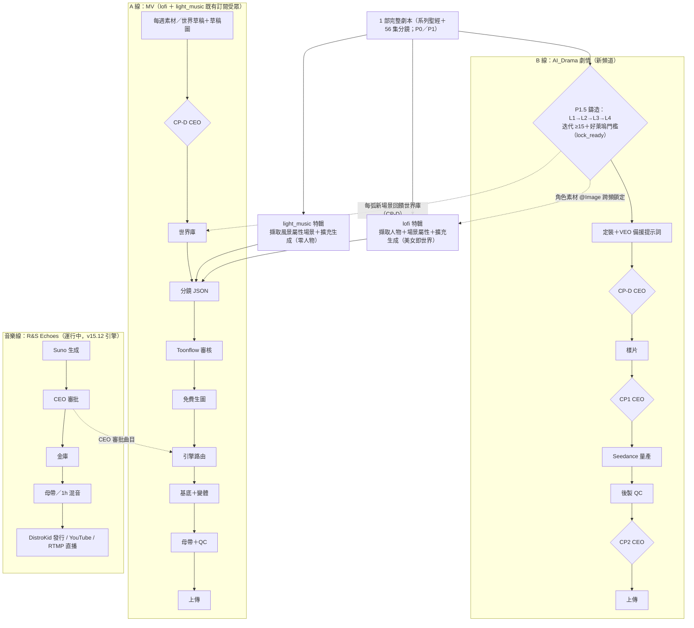
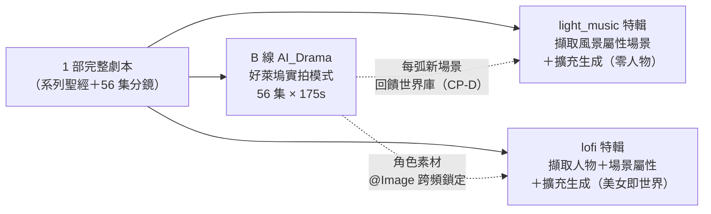
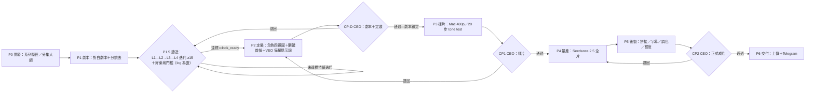

# 架構說明書 v16.2.0 — AI_DRAMA_FACTORY 總體架構（雙線產線 · A 線 MV／B 線 AI_Drama）

**版本**：**v16.2.11**
**最後更新**：2026-09-13
**適用主機**：Windows PC（控制面，可關機）＋ Mac mini M4（執行面，24/7，外接 SSD）
**本版重點（v16.2.11）**：
- **外部團隊雙線改善「版控基線」（2026-09-13）**：forge 證據閘門 `forge.lock.v2`（逐迭代證據鏈＋內容指紋；離線不得 eligible）、A 線 worker 交付防護（母帶雙驗／4n+1 幀＋精準裁切／全檔解碼 QC／任務 journal 不盲重送／OS 互斥鎖）、B 線生成前置（整集提示詞與參考圖先驗、禁生成中補詞）；PC／Mac 隔離環境各 **77 項**通過（證據包入版控；Copilot 獨立複驗重現 77 通過）。
- **複核與路線**：`CEO/04_架構檢視/外部工程複核與世界級缺口補齊路線_v4.md`——七缺口（產能經濟／音樂時間軸／變體 QC／核准閉環／B 線平台期／CI／部署發行）與 P0-P2 補齊路線。入門文件：`雙線改善工程驗收與學習手冊.md`。
- **版控治理**：本批成果建立 Git 基線；`Auto_Drama/`（B 線 LMD 鏈）首次入版控；`Auto_Drama/tests/conftest.py` 修收集路徑；全套回歸 **182 passed / 1 skipped**。
- **未變更**：Mac 正式服務未置換、Y: 生產腳本未動、生成／發布凍結維持。
**本版重點（v16.2.10）**：
- **第一集 CEO 核准→凍結併入正式劇本（§5.0 配套）**：CEO 同意 Ep1 修訂版後落地 **`ceo_locked` 凍結機制**——`<run>/ceo_locked.json` 註冊表＋`ceo_locked/epNN_ceo_approved.json` 內容指紋（sha256）；forge 五路徑強制回填（載入／patch 後／軟回退後／輪換選擇／狀態寫入前）＋節錄輪換**跳過凍結集**；CEO 核准超越一切評審建議。
- **救援紀錄**：Ep1 修訂節錄曾因 iter 129 軟回退（`current` 自王者包重載）被吞；自 `l1_workbench/iter_129.json` 快照還原（2055 字元，與 CEO 所閱《Ep1修訂預覽.md》**逐位元全等**，sha256 `20276719ee8d7620…`），已併入 `state_latest`＋`best_package`＋`best_meta.ceo_approved_ep1`。
- **`.env` 語法修正**：六行自由文字筆記行（dotenv 警告根源）註解化；`siliconflow api key=` 正式化為 `SILICONFLOW_API_KEY`（provider_manager 實際引用之名）。
- **離線測試**：forge 25 項（新：凍結集回填冪等、輪換跳過凍結集）。
**本版重點（v16.2.9）**：
- **CEO 定向修訂通道（§5.0 配套）**：`script_forge` 新增讀取執行目錄 `ceo_notes.md`（CEO 定向指示，最高優先）並注入 **L3 多代理評審團（每輪逐項回答是否已落實）／L2 修訂（最高優先落實）／劇本節錄寫手** 三處提示——CEO 對劇本的直接回饋自此成為迭代收斂向量。
- **第一集改造（CEO 2026-09-12 指示）**：「直播→時光隧道太假」重構＋開局反轉——吸收頭部時光懸疑劇工法（《想見你》執念物件／《開端》規則先行可破解／《背著善宰跑》救贖動機＋反噬代價）：錨定物先行／情感觸發／現實裂縫三步鋪墊／規則與代價 Ep1 內兌現／觀眾在場效應／過場節制；反轉三候選方向（反轉方向／存檔黑洞／幽靈觀眾）由總導演仲裁定稿；指示全文＝`CEO/01_劇本鑄造/timegate-56/修訂指示_第一集.md`。
- **節錄輪換死角修復**：`_EXCERPT_ROTATION` 索引 0（及任何 5 的倍數）與 `it%10==0` 製片計劃分支碰撞 → 該集節錄**永不重寫**（第一集受害）；Ep1 移至索引 9（安全槽位 it=20k+18）。
- **復審機制**：重啟後每一迭代＝一輪多代理複審；另即時執行單輪定向修訂（節錄重寫＋欄位同步）產出《Ep1修訂預覽.md》供 CEO。
- **requirements 清理**：移除 `playwright`／`playwright-stealth`（違反 §10 NO RPA 政策且無活躍 import；v2 檢視 §4.4）。
**本版重點（v16.2.8）**：
- **世界級再設計 v2 交付（§3.7 附註）**：`CEO/04_架構檢視/開源引用策略與系統再設計_v2.md`——三路唯讀深盤（自建 132 py／34,371 行、Y: 57,106 檔／167.62 GB、開源對照矩陣）；十項重複建設收斂計畫＋世界級四支柱（契約凍結／單一真理／可觀測／資源熵治理）；三大產線風險（HITL 未閉環、字幕路徑缺口、Mac forge 缺 13 檔）。
- **ComfyUI 鎖定（§3.7）**：新增 `integrations/comfyui/VERSION.lock`（v0.35.0／HEAD 1d48d9cf／GPL-3.0 外部程序註記／模型清單入帳）——**Toonflow／LMD／ComfyUI 三大開源實體全數完成凍結鎖**。
- **§3.7 LMD 列更新**：「待盤點標註」→「**已鎖** MIT v1.2.8＋補丁台帳（弱治理；待補 overlay／per-file sha256／契約測試）」。
**本版重點（v16.2.7）**：
- **角色一致性「雙錨定制」＋顧問建議複評（§5.5）**：顧問建議「以 SillyTavern 角色卡當角色 Anchor」——複評＝**部分可行**：卡（文字人設＋單頭像）**不可作影像錨**（非多視角、非實拍、社群卡多含第三方 IP）；落地「雙錨定」：**文字錨＝`character_card.v1`**（V2 子集規格：`spec/character_card_v1.md`）＋**影像錨＝P2 四視圖定裝照→`character_vault.db`→`@圖片N`**。
- **SillyTavern 邊界維持**：僅借格式（角色卡／Lorebook 互通），**不作產線依賴**（§5.4 裁定不變）。
**本版重點（v16.2.6）**：
- **CEO 控台摘要改以王者為焦點**：顯示王者 μ／八域／errors 與「距閘門差額」——修復舊摘要以「最新迭代懲罰後淨分」（4.x）誤導進度判讀（王者比較用 μ；現況：王者 μ8.0、最低域 8.0 已達標、距 8.8 還需 +0.8）。
- **小說稿快取防退化**：企劃包更新且離線渲染時，沿用前版小說化正文（stale 標記），不退化為大綱體；`--llm` 執行時自動對齊變更集數。
**本版重點（v16.2.5）**：
- **迭代上限 150 → 1,000（業界通用標準；CEO 修正指令）**：採產業通用做法——**品質閘門為停止條件（gate-driven）、10³ 次評估為單期預算護欄**；好萊塢對標＝一季 56 集劇本修訂事件量級（56×10–20 ≈ 560–1,120）。Phase 1 於舊上限 150 封頂且未達門檻＝舊上限不足之實證。
- **Plateau 警報**：champion 閒置 ≥100 迭代且門檻未達時，每 50 迭代發出警示（僅警示、不自動停）；`run_meta` 記 `best_iteration`。
- **CEO 審核稿＝人類小說體（CEO 2026-09-12 提醒）**：給 CEO 審核的劇本一律以**小說體正文**呈現（新增 `script_novel.py`→《劇本小說版.md》，逐集小說化＋快取）；**LocalMiniDrama 分鏡 JSON 為產線機器格式，嚴禁作為審核稿**（CEO 控台同步不再複製任何 JSON）。
**本版重點（v16.2.4）**：
- **L3 真多代理評審團（§5.0，CEO 2026-09-12 指令）**：審稿層由單一 LLM rubric 升級為**真 AI Agent 團隊**——4 名專業評審（故事結構師／角色與對白指導／神話學顧問／製片 line producer）**並行獨立評審**不同角度，＋1 名**總導演仲裁**合成八域最終分數與跨域 `top_fixes`；任何評審異常＝`degraded` 輪，**不得列王者**（堵住評審故障以假分數封王）。
- **LLM 通道指數退避（§5.0 配套）**：`llm_text` 對 429／5xx／timeout／空回應自動退避重試（≤3 次、2^n＋jitter、封頂 30s）；致命錯誤立即上拋。
- **迭代上限＝150（CEO 定案）**：`DEFAULT_MAX_ITERATIONS=150`；Phase 2 以 `--seed-package` 續跑——Phase 1 封存 `timegate-56_phase1/`（150 迭代王者 μ7.74／iter 134），Phase 2 從王者企劃包續鑄（新 `timegate-56/`，log 為 CP-D 證據）。
- **離線測試**：forge 18 項＋`llm_text` 退避 6 項（含多代理面板合併／degraded／單評審回退）。
**本版重點（v16.2.3）**：
- **「驗證即凍結」上游治理原則（§3.7）**：引用開源＝吸收已通過試誤的成熟碼；經驗證成功（契約測試＋實戰）即凍結，上游更新**是否跟進由我方系統需求決定**（僅三觸發：新功能／安全修補／契約測試失敗）。
- **世界級架構檢視交付（§3.7 附註）**：`CEO/04_架構檢視/世界級架構改善提案_v1.md`——五路唯讀盤點（205 支 py／40,738 行、雙機全量），P0×5／P1×14／P2×10＋三階段路線＋實測核對紀錄。
- **selfcheck.py 修復**：故事室一鍵驗收 11/11 PASS 恢復（py_compile 實證→修復→驗證）。
**本版重點（v16.2.2）**：
- **鑄造 v2 王者規則（§5.0）**：王者（champion）改以「**零 error ∧ μ（八域加權、懲罰前）最高**」判定；總分欄保留懲罰後淨分供稽核——修復 v1「評審 warn 噪聲撞 2.5 懲罰上限 → 真實進步全被 revert 丟棄」的致命缺陷（80 輪卡 7.21 根因）。
- **`--reclaim` 內容回收（§5.0）**：掃 `l1_workbench` 快照、每集留最長劇本節錄併回 `best_package`；首航救回 7 集 reasoner 劇本頁（~1.4 萬字）。
- **製片計劃通道**：每 10 迭代寫入 `production_plan`（製片視角可行性：場景複用／@Image 需求／量產節奏／風險對策），直接拉抬 feasibility 域。
**本版重點（v16.2.1）**：
- **劇本參考素材庫（§5.0）**：CEO 提供五部公版/神話參考（**不強制**）——《山海經十八卷》《聊齋志異》《閱微草堂筆記》《潘朵拉的盒子》《北歐神話》。
- **上游治理與來源邊界（§3.7）**：借鏡／自建對照表、季度採納率審計、L1 雙向整合路線圖；原則＝邊界吃開源、核心自建最小化、契約鎖定、來源標註。
- **§1 產線地圖整合同源三頻模型**：1 劇本 → B 正劇＋LM／LF 特輯；回饋邊＝每弧新場景→世界庫、角色素材→@Image。
- **同源三頻模型圖（§3.5，CEO 2026-09-12 定案）**：1 部完整劇本 → B 正劇＋LM／LF 特輯；回饋邊＝每弧新場景→世界庫（CP-D）、角色素材→@Image 跨頻鎖定；§1 加入指向。
- **工作流 mermaid 全同步**（§1、§5.2）：產線地圖納入 **P1.5 鑄造閘門**（L1→L2→L3→L4 ≥15＋好萊塢門檻）與**一劇三用**派生邊（B → LM／LF 特輯）。
- **CEO 控台資料夾**（§3.6）：所有提供 CEO 理解／審核的資訊一律落點工作區 `CEO/`（`ceo_console.py --sync` 自動同步＋`README.md` 索引）。
- **劇本先行硬閘門**（§5.0）：B 線 **CP-D 前**必須完成 **L1→L2→L3→L4 迭代 ≥15 次**（`script_forge` 逐迭代 log 為證）且達好萊塢門檻（總分 ≥8.8／單域 ≥8.0／零 error）；未達標不得排定定裝照與 CP-D。
- **題材定案（CEO 2026-09-12）**：東方×西方神話奇幻雙棲（現代人物經時光隧道／自媒體入口進入）；**175s 短劇連載・56 集**。
- **共流／分叉再審視**（§3.5）：確立「一劇三用」擴充通道——同一劇本 → B 正劇＋LM／LF 特輯（特輯 100% 走 A 線規則）。
- **素材類型 6 型制**（§4.7）：依 122 支影片庫 100% 審計重塑——light_music＝水光聖殿／暖居儀式／禪境晨光；lofi＝時尚女主／夢境奇物／神話旅人；每週＝1 世界＋**每頻道各 1 型**自動輪替；`--type` 定向補抓。
- **W37 選取回合**：24 幀（6 型×4 查詢）→ **CEO 複篩 16 幀**入庫；**素材一律落點 `assets/reference_intake/inbox/2026-W37/`、審核包一律 `cp_d/2026-W37/`**（圖形拼貼＋世界草案 4 座），並 Telegram 推播 CEO。
- **雙線分界一句話定調**（§3.4）：A 線人物即世界／B 線人物是世間眾生——開發層共用、敘事層分流。
- **免費圖庫 API 週搜尋上線**（§4.7）：Pexels 主力→Pixabay 備援→Unsplash 美學；Mac launchd 每週一 02:00；首航 20 張。
- **CP-D 世界草案引擎上線**（§4.7）：視覺分析（Gemini→GLM-4V 鏈）→ 3–5 座草案＋VEO 備援提示詞 → Telegram 審核包推播。
- **品質標準**：樣片與量產一律 20 步（8 步僅工程煙霧測試）。
**沿革**：
- v16.1–v16.1.9：雙線重構、CP-D 三關卡定案、20 步標準、圖庫 API、素材 6 型制、劇本先行閘門、CEO 控台、同源三頻定案圖（詳 §13 變更歷史）
- v15.12：音樂線 DistroKid 正規發行引擎（封存於 `spec/`）
- v16.0–v16.0.3：故事室 v3／後期工坊／整合層／Toonflow 動態埠（封存於 `spec/`）

> **本文件是系統的單一權威總覽**；與 `.github/copilot-instructions.md` 同步維護，規則修訂須兩處一致（CEO 授權）。

---

## 0. 一句話＋五層架構

產線已從「能自動生成」進化為「**以劇本為核心、可被驗證與迭代的雙線系統**」（A 線 MV ／ B 線 AI_Drama）；**Seedance 生成仍凍結**，直到 B 線 CP1（或 CEO 逐案）確認可量產。

| 層 | 元件 | 文件 |
|---|---|---|
| L1 工作台層 | Toonflow（v1.1.8 鎖定；A 線審核）／LocalMiniDrama-main（B 線 cockpit） | `docs/INTEGRATIONS_TOONFLOW.md` |
| L2 起草層 | story_room：題材庫／Hook／Twist／多樣性矩陣／世界庫 | `docs/STORY_ROOM_V3.md` |
| L3 審稿層 | 三代理對抗迴圈（Writer/Critic/Director）＋六域 rubric | 同上 |
| L4 維度庫 | 伏筆帳本／Canon 一致性／節奏曲線 | `docs/STORY_ROOM_V3.md` |
| L5 生產鏈 | 分鏡映射 → Mac Wan／VEO／Kling（A 線）、Seedance 2.5（B 線，凍結解除後）→ 後期工坊 P3–P8 → QC → HITL | `docs/POST_WORKSHOP.md` |
| 橫向 | MCP 單向 façade（給代理用） | `docs/MCP_FACADE.md` |

> **B 線劇本先行硬閘門（CEO 2026-09-12 指令）**：進入 **CP-D** 前，劇本必須完成 L1→L2→L3→L4 迭代 **≥15 次**（`script_forge` 逐迭代 log 為唯一證據）並達好萊塢門檻（總分 ≥8.8／單域 ≥8.0／零 error）；未達標不得排定定裝照與 CP-D（§5.0）。

---

## 1. 產線地圖與 CEO 檢查點

> **同源三頻模型（CEO 2026-09-12 定案）已整合於下圖**（1 部劇本 → B 正劇＋LM／LF 特輯；回饋邊＝每弧新場景→世界庫、角色素材→@Image）；原定案圖另見 §3.5。



| 檢查點 | 產線 | 頻率 | 內容 | 通過後果 |
|---|---|---|---|---|
| **CP-D（開發關卡，2026-09-12 新增；A/B 共用）** | A＋B | A 每週／B 每集 | A：世界草稿（世界史／劇本）＋世界觀草稿圖；B：劇本＋定裝照——**均附 VEO／Flow 免費生圖備援提示詞** | A：`world_library.commit()`；B：**Script Lock（hash 建檔）** |
| A 線既有審核 | A 線 | 每集 | Toonflow 審核（世界聖經/分鏡/正文） | 允許動用影片引擎與點數 |
| **CP1** | B 線 | 每集 | 樣片確認（劇本已於 CP-D 鎖定） | 進入 Seedance 量產（附成本預估） |
| **CP2** | B 線 | 每集 | 正式成片審查 | 上傳 YouTube＋Telegram 通知 |
| 曲目審批 | 音樂線 | 每批 | `ceo_approved_beats/` 曲目核准（既有流程） | 進入母帶/混音/發行 |

> 其餘節點全部由**自動 QC 阻斷**；里程碑以 Telegram 通知（不打擾原則）。

---

## 2. 主機拓撲、分工與跨機契約

### 2.1 主機拓撲與原則
| 主機 | 角色 | 原則 |
|---|---|---|
| **Windows PC**（`F:\AI_DRAMA_FACTORY`） | 控制面：腳本生成、LocalMiniDrama 分鏡、派送、CEO 互動、音樂線 UI | **可隨時關機**，不得承載長時程工作 |
| **Mac mini M4**（`/Volumes/AI_Workspace/AI_Drama_Factory`，SMB 宿主） | 執行面：渲染（Wan）、後製、QC、上傳、launchd 排程、Toonflow | **24/7 運轉**；長時程工作一律在此 |
| 共享通道 | `Y:\AI_Drama_Factory\…` ＝ Mac 同路徑（`\\192.168.2.200\AI_Workspace`） | 跨機檔案**一律走 Y:** |

### 2.2 主機分工
| 工作 | Windows PC（可關機） | Mac mini（24/7） |
|---|---|---|
| A 線腳本生成（story_room） | ✅ | — |
| A 線審核（Toonflow） | 瀏覽器遠端可開 | ✅ 服務宿主 |
| A 線世界擴充分析（CP-D 提案） | 手動可觸發 | ✅ launchd `com.aidramafactory.reference.intake`（**每週一 02:00**：圖庫週搜尋＋Telegram；世界分析提案待建） |
| A 線外部生成（VEO／Kling，CEO 手動） | ✅ 瀏覽器 | —（僅 ingest） |
| B 線劇本＋分鏡（LocalMiniDrama-main） | ✅ 互動式 | — |
| B 線轉接器（分鏡 → 合約 → job） | ✅ | — |
| 渲染（Wan／樣片） | — | ✅ worker＋ComfyUI |
| B 線量產（Seedance 2.5） | — | ✅（建議；呼叫端待定案） |
| 後製＋QC | — | ✅ |
| 上傳＋Telegram | — | ✅（憑證僅在 Mac） |
| 長時程排程（launchd） | — | ✅ |
| 音樂線 UI（Streamlit）＋發行 | ✅（現狀保留） | RTMP 直播／Shorts（launchd，現狀保留） |

### 2.3 跨機檔案夾契約（PC 一律經 Y: 共享；Mac 為共享宿主）
| 用途 | PC 路徑 | Mac 路徑 | 寫入 → 讀取 |
|---|---|---|---|
| 派送佇列 | `Y:\AI_Drama_Factory\Auto_Drama\output\handoff\inbox` | `/Volumes/AI_Workspace/AI_Drama_Factory/Auto_Drama/output/handoff/inbox` | PC → Mac worker |
| 工作狀態 | 同上 `processing`／`done`／`failed` | 同 | Mac worker（狀態唯一權威） |
| 母帶音樂 | `Y:\...\assets\audio\ceo_approved_beats\` | `/Volumes/.../assets/audio/ceo_approved_beats/` | CEO／PC → Mac（含 sha256） |
| 外部生成批次（A 線） | `Y:\...\Auto_Drama\output\external\<batch>\frames`＋`incoming` | 同 | CEO → Mac ingest |
| 世界觀素材入口 | `Y:\...\assets\reference_intake\inbox\` | `/Volumes/.../assets/reference_intake/inbox/` | CEO → Mac 分析 |
| 成片檢視 | `Y:\...\Auto_Drama\output\handoff\done\<job>\` | 同 | Mac → CEO |
| 腳本工件（PC 本地） | `F:\AI_DRAMA_FACTORY\Auto_Drama\output\sandbox\story_room\` | ❌ 不跨機（job 內已含 prompt） | PC 專用 |

**鐵律**：跨機檔案一律走 `Y:`（Mac 宿主）；派送工件內**嚴禁出現 `F:` 本機路徑**。

### 2.4 Handoff 合約（`handoff.job.v1`）
- 生命週期：`inbox/`（PC 派送）→ `processing/`（worker 認領）→ `done/`｜`failed/`（附 `status.json`）。
- 內容：`production`（引擎/解析度/fps/steps/cfg）、`music`（母帶路徑＋sha256）、`shots[]`（prompt/seed/units）。
- Mac worker（LaunchAgent `com.aidramafactory.mv.render_worker`，單實例守衛）24/7 監看；PC 關機不影響。

---

## 3. 資料契約與整合規範

### 3.1 資料契約（唯一進出口）
- **`story_contract.v1`**：`topic, logline, hook, theme, target_sec, acts[3], beats[10-12], characters[]`
- 生產格式：`music_drama.v2`（A 線；零對白、鏡長 4–30s、480p 政策、music_master 政策）
- 規則：**換任何上游，契約內不動**；上游改版只影響其適配器。

### 3.2 整合規範（抗改版六律）
1. 鎖版：git tag／Docker image／installer SHA-256（`VERSION.lock`）。
2. 隔離：每套外部系統獨立資料夾＋獨立容器。
3. 契約測試：`integrations/<name>/contracts/roundtrip_check.py`，升級必跑。
4. 降級通道：任何外部系統故障時，人工導出→匯流器仍可交件。
5. 升級窗口：季度審查＋release notes 對照；**禁止自動更新**。
6. MCP 只做窗：規格改版不影響承重結構。

### 3.3 政策（沿用＋新增）
- **Seedance 凍結令**：未經 B 線 **CP1**（或 CEO 逐案）確認可量產前，零生成呼叫。
- 480p 成本政策、零對白 MV 鐵律、music_master 音軌政策、Telegram HITL、$0 優先原則。
- 圖文生成使用政策：分鏡圖可走免費層（**留意浮水印**，見 §8.2）；付費引擎需 CEO 核准。
- 文件政策（2026-09-11 CEO 指示）：**系統建置與驗證必須文件化**（本文件＋各模組文件）；執行過程紀錄留在對話/終端。

### 3.4 共用創意開發層（Creative Development Layer，A/B 共用；2026-09-12 設計）
> **雙線分界一句話定調：A 線的人物即世界本身；B 線的人物是世間眾生。**
> 意涵：**開發層（素材／草稿／CP-D／入庫管線）兩線完全共用**；**敘事層自此分流**——
> A 線無角色卡（人物＝世界的情感載體；lofi 100% 美女、light_music 零人物），
> B 線角色卡完整（個體、姓名、弧光、跳集連續；四視圖＋@Image 硬閘門，§5）。

```
[品味入口] CEO 網址清單／Pinterest／cosmos.so／自營頻道（每週搜尋，見 §4.7）
      ↓
[素材庫] assets/reference_intake/（候選圖＋來源標註）
      ↓ 視覺分析＋分類（環境／場所 vs 人物／服裝／道具）
[草稿提案] A：世界草稿（世界史＋色票＋錨點）＋世界觀草稿圖
          B：劇本＋角色定裝照（四視圖）＋場景
      ↓ 同時輸出：VEO／Flow 免費生圖備援提示詞（EN＋目標檔名）
[CP-D] CEO 一次確認（不滿意 → 用 Flow 免費重生 → 丟回 intake 再審）
      ↓ 通過
[入庫] A：world_library.commit()（novelty ≥ 0.25）／B：character_vault＋scene_vault＋Script Lock
      ↓
[分流] A → MV 分鏡（§4）｜B → 劇集分鏡（§5）
```

| 差異點 | A 線 | B 線 |
|---|---|---|
| 人物建模 | **無角色卡**——人物是世界的一部分（cast policy：lofi＝100% 美女） | **角色卡**——個體、姓名、弧光、跳集連續（四視圖＋@Image） |
| 「劇本」型態 | 世界史／正文（零對白） | 對白劇本＋分鏡 |
| 入庫目標 | `configs/world_library.json` | `character_vault.db`／`scene_vault.db` |

**備援系統（VEO／Flow 免費生圖）**：系統產生每張草稿圖時，同步輸出可直接貼上的生圖提示詞與目標檔名；CEO 若不滿意系統草稿，可在 Flow 免費重生成（0 點）並將成圖丟回 `reference_intake/` 續審。

### 3.5 A／B 共流與分叉（v1.3 再審視；CEO 2026-09-12）

> 一劇三用：同一部 56 集劇本 → B 線正劇＋light_music 特輯（風景／零人物）＋lofi 特輯（人物＋場景／美女即世界）。

**同源三頻模型（CEO 2026-09-12 定案）**



**共流點（A／B 同管線）**
| # | 共流 | 說明 |
|---|---|---|
| 1 | 創意開發層 | 素材→視覺分析→CP-D→入庫（§3.4）完全共用 |
| 2 | 鑄造迴圈 | L1→L2→L3→L4 迭代（A 用 `agents.run_adversarial` 變體版；B 用 `script_forge` 連載版）；B 之 ≥15 迭代閘門見 §5.0 |
| 3 | 世界／素材庫 | 戲劇場景優先取自 `world_library`；每弧新場景經 CP-D 入庫，三頻共用同一座宇宙 |
| 4 | 角色資料流（單向） | B 角色卡／場景卡可供 LM／LF 特輯生成使用（@Image）；A 線本身仍無角色卡 |
| 5 | 跨機與派送 | §2.4 handoff 合約、Y: 共享、Mac worker 佇列 |
| 6 | QC／HITL／發布 | 自動 QC、Telegram 審核、§10a 上傳自動化 |

**分叉點（各自鐵律）**
| # | 分叉 | A 線 | B 線 |
|---|---|---|---|
| 1 | 敘事契約 | 零對白；人物＝世界（lofi 美女／LM 零人物） | 對白劇本；人物有個體弧光 |
| 2 | 音軌 | 母帶 MP3 唯一主軌（§10b） | 保留生成原始音軌（§2.2）；BGM 以 amix 疊加 |
| 3 | 檢查點鏈 | 免費生圖批准→成品 | CP-D→CP1→CP2 |
| 4 | 引擎路由（§4.4） | Mac Wan 基底＋VEO／Kling 英雄鏡 | Seedance 2.5（凍結解除後） |
| 5 | 節奏 | 每頻道每週 1 集（175s） | 試播制連載（每週 1 集） |
| 6 | 特輯 | —— | 由 B 劇本派生 LM／LF 特輯（**特輯仍 100% 走 A 線規則與閘門**） |

**紅線**：特輯不得使用戲劇對白與原始音軌；§4.5 變體規則對特輯照常適用；B 正劇不得挪用 A 頻道已發布素材。

### 3.6 CEO 控台資料夾（CEO Console；CEO 2026-09-12 指令）

> 所有需要提供 CEO 理解或審核的資訊**一律**存放於工作區根目錄 `CEO/`（PC：`F:\AI_DRAMA_FACTORY\CEO\`）。

| 子夾 | 內容 | 來源（產線單一真理，不搬動） |
|---|---|---|
| `01_劇本鑄造/<series>/` | `進度摘要.md`、`iteration_log.md`、最新迭代、`lock_ready.json` | `Auto_Drama/output/script_forge/<series>/`（Y:） |
| `02_素材與CP-D/<week>/` | `review.html`、拼貼圖、`proposal.md`、`veo_prompts.txt`、素材圖＋manifest | `assets/reference_intake/{inbox,cp_d}/<week>/`（Y:） |
| `03_樣片與交付/` | 樣片清單（pass／長度／輸出路徑） | `Auto_Drama/output/handoff/done/`（Y:） |
| `README.md` | 自動生成索引（每次同步更新） | `scripts/common/ceo_console.py --sync` |
| `00_命名規則.md` | **命名權威**（目錄／檔案／RUNID／生成物邊界） | 手寫（CEO 指示 2026-09-13；v1） |

> 同步工具只**複製**審核副本，永不移動產線原件；里程碑（鑄造迭代、CP-D 包更新、樣片出爐）後必跑 `--sync`。CEO 副本禁止回流為產線來源。
> **命名規則（CEO 2026-09-13）**：`CEO/` 全樹依《`00_命名規則.md` v1》——頂層 `NN_分類`、時間戳一律 UTC `YYYYMMDDTHHMMSSZ`、文件升版＝新檔 `_v<N>`、`README.md` 為生成物禁手改。

### 3.7 上游治理與來源邊界（Provenance & Reuse Boundary；CEO 2026-09-12 指示）

> **原則（系統最佳品質裁定 2026-09-12）**：**邊界吃開源、核心自建最小化、契約鎖定、來源標註、季度採納審計。**
> 目標不是「100% 追隨開源」——那會讓上游改版穿透 CEO 關卡（違反 §3.2 抗改版六律與 ZERO SILENT FAILURES）；正確做法是每一層都能說清楚「用誰、為何用/不用、如何換」。

> **「驗證即凍結」原則（Pin-once-Validated；CEO 2026-09-12 理念）**：引用開源之目的＝吸收**已通過長期試誤（try-and-error）**的成熟碼，而自建碼仍需成長驗證；**經驗證成功（契約測試＋實戰實證）之引用版本即凍結**——上游即使更新，**是否跟進由我方系統需求決定**（觸發條件僅三：①需要新功能 ②安全修補 ③契約測試失敗），不自動追隨上游節奏。
> **新功能決策樹**：上游已有 → 建適配器；開源有已驗證方案 → 鎖定引用；僅業務特有 → 自建（最小化，並登記「上游為何不堪用」）。
> **世界級架構檢視交付**：`CEO/04_架構檢視/世界級架構改善提案_v1.md`（五路唯讀盤點：205 支 py／40,738 行、雙機全量；P0×5／P1×14／P2×10＋三階段路線）。
> **再檢視 v2（2026-09-12）**：`CEO/04_架構檢視/開源引用策略與系統再設計_v2.md`——三路深盤（自建 132 py／34,371 行＋Y: 167.62 GB＋開源對照）＋十項收斂計畫＋世界級四支柱＋30/90/季度路線圖。

**借鏡／自建對照表**

| 層 | 來源 | 採用方式 | 授權/標註 | 為何如此 |
|---|---|---|---|---|
| L1 工作台 | Toonflow（`HBAI-Ltd/Toonflow-app`，鎖 tag **v1.1.8**） | **整機外部系統**＋適配器（`converters/toonflow_import.py`、`import_to_toonflow`） | Apache-2.0（外部未改碼） | 審核 UI 為成熟品，無需重造 |
| L1 工作台 | LocalMiniDrama-main（上游 **v1.2.8**，MIT） | 上游原封保留（B 線 cockpit）＋就地補丁 8 檔（台帳）；**整合進行中（見路線圖）** | **已鎖** `integrations/localminidrama/VERSION.lock`（2026-09-12；待補 overlay＋per-file sha256＋契約測試） | 上游 cockpit／三庫是其價值 |
| L2 起草 | story_room（自建） | **自建**（概念借鏡：OpenWrite 六域＋review DAG；開場規則受公開工作流啟發） | 概念借鏡、未複製程式碼 | 上游不含 175s×56／6×30s／零對白 MV／雙軌標記等業務規則 |
| L3 審稿 | agents／script_forge（自建） | **自建** | —— | ≥15 迭代 log 閘門＋八域好萊塢 rubric 為 CEO 專屬門檻 |
| L4 維度庫 | critic_dims／script_forge 規則維度（自建） | **自建**（checkable data structures） | —— | 伏筆帳本/Canon/節奏需證據化且可離線測試 |
| L5 生產鏈 | Mac Wan／VEO／Kling／Seedance 2.5 API | 外部引擎＋自建排程（handoff 合約） | 各引擎條款 | 生成能力外購，編排與規則自持 |
| L5 生產鏈 | ComfyUI（comfyanonymous，**v0.35.0**，GPL-3.0 外部程序） | 原生 HTTP API（Mac :8188；A 線渲染主力） | **已鎖** `integrations/comfyui/VERSION.lock`（2026-09-12；模型清單入帳，sha256 待補） | 成熟渲染引擎作 GPU 後端，不重造節點系統 |

**採納率審計與季度審查**
- 隨 §3.2 升級窗口（每季）執行「上游採納審計」：盤點上游已有功能 vs 我方重造功能 → 能採用者改走適配器。
- 現行目標：**L1＝100% 上游**（達成）；**L2＝混合**（待盤點採納率）；**L3/L4＝刻意自建**（每季複核是否仍必要）。
- 年度目標：**重造面積只減不增**——新需求先查上游，再考慮自建。

**缺口與路線圖（2026-09-12 起）**
1. **L1 雙向整合**：LocalMiniDrama cockpit 消費 `l1_workbench/`（系列聖經／56 集大綱／迭代落版），成為 B 線記錄之錨；劇本鐵閘仍由 `script_forge` 執行。
2. **授權標註盤點**：OpenWrite 等概念來源補齊授權欄（僅概念借鏡、無碼複製；若證實可對接則評估 API 化）。
3. **對照表維護**：每次新增自建模組，需在本表登記「上游為何不堪用」一行理由。

---

## 4. A 線工作流（MV）

### 4.1 題材與腳本
1. `configs/world_library.json`（22 座世界）＋ `scripts/story_room/` 產生 **3 主題 × 5 版本**驗證批次。
2. 離線結構生成 → **世界優先合約驗證**（`validate_music_world_story`）→ DeepSeek 正文擴寫（快取 `vN.prose.txt`）。
3. 產物：`Auto_Drama/output/sandbox/story_room/p3_experiment/<topic>/v<N>.json` —— **唯一真理**，下游不得動態改詞。

### 4.2 審核（Toonflow）
`python -m scripts.import_to_toonflow` 匯入 Mac Toonflow（`http://192.168.2.200:12088`），CEO 審閱世界聖經、分鏡與正文。

### 4.3 免費生圖關卡（Flow／Nano Banana／Imagen 4＝0 點）
1. 系統自驗證後的分鏡派出生圖提示詞＋幀合約（檔名、比例、解析度）。
2. CEO 在 Flow 免費生圖 → 放入 `external/<batch>/frames/shXXX.png`。
3. **CEO 批准畫面後才允許動用影片點數**（VEO／Kling）。

### 4.4 生成（引擎路由）
| 引擎 | 角色 | 成本 |
|---|---|---|
| Mac Wan 2.1（480x848，**20 步**≈3.3 小時/單元） | 環境／過場基底鏡、CEO 樣片 | 電費（24/7 Mac） |
| VEO（Flow） | 英雄鏡（開場／美女／收尾） | 點數制；**先過浮水印紅線**（§8.2） |
| Kling | 動態強的鏡頭（走秀、布料、動作） | 點數制 |

> **步數標準（CEO 2026-09-12 定案）**：產線與**對 CEO 的樣片一律 20 步**；8 步僅限工程煙霧測試（`dispatch_to_mac.py --smoke-test`），嚴禁用於品質驗收。

### 4.5 基底＋變體剪輯（**CEO 2026-09-12 核准**）
單一生成片段可在成品中重現，但**必須全部滿足**：

| # | 規則 |
|---|---|
| 1 | 每個基底片段重現 **≤ 3 次**，每次都有**可見變體**（裁切推拉／變速／倒放／色調／鏡像） |
| 2 | **禁止相鄰兩段完全相同** |
| 3 | 全片**原生（獨立）素材覆蓋率 ≥ 60%**（175s → 至少 ~105s 為獨立鏡頭） |
| 4 | 變體清單寫入該集 manifest（`variation_plan`，可稽核） |

> 此為對「嚴禁 `-stream_loop`／無窮循環」的**明文局部放寬**（copilot §2.1a），僅限 MV 產線；B 線短劇不適用。程式常數：`mv_strategy.BASE_VARIATION_POLICY`。

### 4.6 組裝與發布
1. 線性拼接：`concat demuxer` 無損複製（`-c:v copy`）。
2. 音軌：母帶 MP3 為**唯一主軌**（copilot §10b）；生成音僅允許 -27 dB 墊底或剔除。
3. QC：ffprobe（H.264＋AAC 48kHz）＋ 浮水印檢查 ＋ 變體規則檢查。
4. Mac 上傳 YouTube（§10a：OAuth／youtubeuploader；**禁止瀏覽器自動化**）→ **Telegram 通知 CEO**。

### 4.7 世界觀擴充週流程（CP-D 檢查點，CEO 2026-09-12 核定）
**目標**：世界庫**每週定期注入新素材**，保持題材多樣化，並保留 CEO 確認機制（含草稿圖與 VEO 備援）。

```
[素材雙軌] ① 系統每週自動搜尋：免費圖庫官方 API（Pexels 主力 → Pixabay 備援；Unsplash 美學補充；
          查詢由世界庫自動生成；下載一律落地本機、禁 hotlinking）
          ② CEO 人工策展：Pinterest／cosmos.so 匯出圖（無公開 API；**不申請 API**，僅人工）
      ↓ 每週一次（建議週日晚）
[素材落地] 候選圖 → assets/reference_intake/inbox/（Mac 共享區；含來源標註）
      ↓
[系統提案] Mac 排程（launchd 週任務）：視覺分析 → world_library.propose_batch()
      產出 3–5 個世界草案（chronicle 草稿＋3 錨點＋色票＋novelty 分數）
      ＋**世界觀草稿圖＋VEO 備援提示詞**
      ↓
[CP-D] Telegram 通知 CEO → 審核：批准／退回／用 Flow 免費重生草稿圖後再審
      ↓ 批准
[入庫] world_library.commit()（novelty ≥ 0.25 硬規則）→ 回到 §4.1 輪替批次
```

| 規則 | 內容 |
|---|---|
| 頻率 | 每週 1 次；每次入庫 ≤ 3 座世界（防題材疲乏） |
| 來源 | **雙軌**：① 免費圖庫官方 API（**Pexels 主力 → Pixabay 備援**；Unsplash 美學補充；可商用、免署名；額度以官方公告為準、實作保守節流）② Pinterest／cosmos.so 人工策展（**不申請 API**）；**兩者皆嚴禁爬蟲；素材一律下載落地＋出處建檔** |
| 硬閘門 | novelty ≥ 0.25、chronicle 不得留「待補」、錨點與色票齊備 |
| CP-D | 比照 CP 機制：Telegram 推播＋Approve／Reject；通過才 commit |
| 落點鐵律 | **素材一律 `assets/reference_intake/inbox/<week>/`；審核包一律 `assets/reference_intake/cp_d/<week>/`**；禁止另立投遞資料夾（2026-09-12 CEO 糾正落實） |

**實作與排程（2026-09-12 上線）**
| 構面 | 內容 |
|---|---|
| 週搜尋工具 | `scripts/reference_intake/stock_search.py`——鏈：**Pexels → Pixabay → Unsplash**（前者得果即停）；ISO 週查詢輪替（規劃器 v2）；下載落地＋provenance manifest（sha256／來源頁／授權）；`--dry-run`／`--type` 定向補抓 |
| 查詢庫 | `configs/stock_search_queries.json`（世界查詢＋**頻道類型 6 型**：light_music＝水光聖殿／暖居儀式／禪境晨光、lofi＝時尚女主／夢境奇物／神話旅人；`channel.type` 分組，每週＝1 世界＋**每頻道 1 型**自動輪替） |
| 排程入口 | `scripts/reference_intake/weekly_intake.py`（冪等：同週已入庫即跳過；成功／失敗均推 Telegram） |
| Mac 排程 | launchd `com.aidramafactory.reference.intake`——**每週一 02:00**（plist 版控於 `scripts/reference_intake/`） |
| 金鑰 | PC：`.env`＋Windows 憑證管理員；Mac：`~/Library/Application Support/AI_Drama_Factory/reference_intake.env`（chmod 600）；轉移工具 `stage_keys_for_transfer.py`＋`install_keys_from_env.py`（**值不入對話、不進版控**） |
| 首航實績 | **2026-W37：20 張、failures=0（Pexels）**；落點 `assets/reference_intake/inbox/2026-W37/` |
| 6 型選取回合（v16.1.5） | **2026-W37：24 幀（6 型×4 查詢，Pexels 直式）→ CEO 複篩保留 16 幀**；**素材入庫落點 `assets/reference_intake/inbox/2026-W37/`**（curation 稽核寫入 manifest）；**審核包 `cp_d/2026-W37/`**（review.html＋拼貼圖＋世界草案 4 座）；依 122 支影片庫審計（`video_clips/_audit_20260912/`）定調 |
| 世界草案引擎 | `scripts/reference_intake/world_proposal.py`——視覺分析（**Gemini→GLM-4V 備援鏈**）→ 世界候選（既有世界衍生 mutant＋新世界聚類）→ `world_library.novelty` 排序 → **頻道平衡挑選（lofi／light_music 輪替，修正 lofi-only 偏食 RCA）** → **3–5 座草案**；**永不 commit**（commit 為 CEO 專屬閘門） |
| VEO 提示詞（頻道化） | 運用 Veo 3.1 能力：**Ingredients 參考圖（角色/場景鎖定）＋角色跨鏡一致性＋camera controls**；**lofi＝一位美女角色（世界的情感門面、同名角色跨鏡鎖定）**、**light_music＝零人物（建築與自然）**；零對白、8 秒鏡、母帶後配 |
| CP-D 審核包 | **`assets/reference_intake/cp_d/<week>/`**：**`review.html`（圖形審核頁＝CEO 主介面，瀏覽器直接看圖）**＋`proposal.json`（機器）＋`proposal.md`（文字備份）＋`veo_prompts.txt`；**Telegram 以相簿推送**每座草案錨點圖（人類以圖判圖） |
| 週排程整合 | `weekly_intake.py`：素材完成後自動接草案引擎（同週已有包則跳過）；素材與草案兩階段各一次 Telegram 推播 |
| 下一步 | **Approve→commit 審核流**（解析 CEO 回覆→`world_library.commit()`；目前由人工指令執行） |

---

## 5. B 線工作流（AI_Drama 劇情頻道）

> 好萊塢工作室流程：**由廉到貴的 fail-fast**、**劇本鎖定 Script Lock**、**系列聖經**、**三道檢查點（CP-D／CP1／CP2）**。

### 5.0 劇本先行：L1→L2→L3→L4 鑄造迴圈（CEO 2026-09-12 指令）

> **指令**：劇本先行；在「第一個 Checkpoint＝CP-D（劇本審查＋定裝照）」之前，五層架構中的四個工作層 **L1→L2→L3→L4 必須迭代 ≥15 次（或更多）**、逐迭代寫 log 為證，且劇本達到**好萊塢製作水準**，才可排定 CP-D。

| 項 | 內容 |
|---|---|
| L1 工作台 | 每迭代落版至 `l1_workbench/iter_NN.json`（供 LocalMiniDrama cockpit 讀取） |
| L2 起草 | story_room 種子／修訂（DeepSeek 文字通道；56 集企劃包＝系列聖經＋分弧＋56 集大綱＋Pilot 對白） |
| L3 審稿 | **多代理評審團（真 AI Agent，CEO 2026-09-12 指令）**：4 名專業評審**並行**獨立評審（故事結構師／角色與對白指導／神話學顧問／製片 line producer，各評其域）→ 1 名**總導演仲裁**合成八域（concept／structure／character／dialogue／mythology／feasibility／hook_density／dual_track）＋跨域 top_fixes；評審異常輪＝`degraded`（不得列王者）＋規則維度合併 |
| L4 維度庫 | 規則檢查：56 集網格／分弧連續覆蓋／伏筆（全劇 ≥8、每弧 ≥2）／角色弧光與進入方式／LM-LF 擴充標記 |
| 門檻（閘門） | **迭代 ≥15** ∧ **總分 ≥8.8** ∧ **單域 ≥8.0** ∧ **零 error** → 寫 `lock_ready.json`（CP-D 入場證） |
| 王者規則（v3） | 每迭代評分後，王者更新條件＝**零 error ∧ 非 degraded ∧ μ（八域加權平均、懲罰前） > 現任王者**；修訂底本採**軟累積**——僅 μ 跌破王者 0.6 以上才 revert，否則在原底本上累積修正（修復「每輪 revert 導致修正失憶」）；劇本節錄寫手携 canon 護欄＋近期評審發現（防重複注入矛盾）；`iteration_log.md` 續跑列以 `μ` 前綴標最新制（總分欄＝懲罰後淨分，供稽核；`⚠`＝degraded 輪）；**迭代上限 1,000（業界標準 10³；gate 達成即停）**；champion 閒置 ≥100 迭代時每 50 迭代發 `plateau` 警報 |
| 產物路徑 | `Auto_Drama/output/script_forge/<series>/`（`iteration_log.md`、`iter_NN.json`、`state_latest.json`、`lock_ready.json`）；相位封存／續跑：Phase 1→`<series>_phase1/`，Phase 2 以 `--seed-package` 從王者企劃包續鑄（新 `<series>/`） |
| CEO 審核稿（小說體） | **給 CEO 審核的劇本一律小說體**（人類閱讀格式；`script_novel.py` 由王者企劃包轉譯→《劇本小說版.md》落點 CEO 控台）；**LocalMiniDrama 分鏡 JSON＝產線機器格式，嚴禁作為 CEO 審核稿**（同步不複製 JSON） |
| 工具 | `scripts/story_room/script_forge.py`（`--status`／`--gate-check`／`--resume`／`--reclaim`／`--seed-package`；forge 離線測試 20 項＋`llm_text` 退避 6 項）；`scripts/story_room/script_novel.py`（小說體審核稿） |
| 題材定案 | 東方×西方神話奇幻雙棲；現代人物經時光隧道／自媒體入口；175s 短劇連載・56 集（480p 政策）；**參考素材庫（不強制）**：《山海經十八卷》《聊齋志異》《閱微草堂筆記》《潘朵拉的盒子》《北歐神話》 |

> **未達標即阻斷**：`--gate-check` 未過（無 `lock_ready.json` 或迭代 <15）時，**嚴禁**排定 P2 定裝與 CP-D。

### 5.1 設計原則
| 原則 | 內容 |
|---|---|
| 檢查點鏈 | **CP-D（開發：劇本＋定裝，A/B 共用）→ CP1（樣片）→ CP2（正式成片）**。其餘節點由自動 QC 阻斷（**CEO 2026-09-12 定案：維持 3 關卡**） |
| Fail-Fast（由廉到貴） | 文字 → 靜圖 → 樣片 → 量產，每階段成本低一個量級；問題在前段攔下 |
| 劇本鎖定 | CP1 通過即產生劇本＋分鏡 hash 鎖定；量產起所有 prompt 必須派生自鎖定版本 |
| 系列聖經 | 角色／場景／道具三庫跨集累積複用（LocalMiniDrama 原生三庫＋Mac vault） |
| 單一真理 | 上游匯入一律經轉接器化為合約分鏡 JSON，不得繞過 |

### 5.2 階段機與兩檢查點



| 階段 | 主機 | 產出 | 自動化閘門（不過即阻斷） |
|---|---|---|---|
| P0 開發 | LocalMiniDrama-main（上游 v1.2.8） | 系列聖經、分集大綱 | 合約驗證：JSON 閉合、章節連續 |
| P1 劇本 | 上游 → 轉接器 | 分集劇本（含對白）＋分鏡表 | `story_contract` 驗證、節奏／字數 lint |
| **P1.5 鑄造（v16.1.6）** | PC 控制面（DeepSeek 文字通道） | 迭代版企劃包＋逐迭代 log（`Auto_Drama/output/script_forge/<series>/iteration_log.md`） | **L1→L2→L3→L4 迭代 ≥15＋好萊塢門檻（總分 ≥8.8／單域 ≥8.0／零 error）；`lock_ready.json`＝CP-D 入場證** |
| P2 定裝 | PC 控制面（Flow 免費生圖＋角色生成） | 角色四視圖、場景、關鍵首幀＋**VEO 備援提示詞** | **角色基準圖硬閘門**（copilot §5） |
| **CP-D** | — | **CEO 一次審查（A/B 共用）**：B＝劇本＋定裝；A＝世界草稿＋草稿圖 | 通過 → **Script Lock**（B）／world 入庫（A） |
| P3 樣片 | Mac（Wan 20 步，LaunchAgent 24/7） | 關鍵 1–2 鏡 tone test（480p） | 樣片 QC：解析度、長度、音軌、浮水印 |
| **CP1** | — | **CEO 審查樣片**（劇本已於 CP-D 鎖定） | 通過 → 進入 Seedance 量產（附成本預估） |
| P4 量產 | Seedance 2.5（呼叫端建議移 Mac） | 175s＝6×30s 長鏡（480p 預設／720p 逐案） | 每鏡落地即驗（解析度／長度／codec／音軌；**不剝離原始音軌**）＋DB 同步；失敗隔離＋指數退避 |
| P5 後製 | Mac | 拼接、字幕、調色、響度（-14 LUFS） | ffprobe＋響度＋浮水印＋角色一致抽查 |
| **CP2** | — | **CEO 審查正式成片** | 通過 → 交付 |
| P6 交付 | Mac | YouTube 上架＋Shorts 切條（選配） | 上傳後 Telegram 回報 video_id |

### 5.3 專業化細節（好萊塢對標）
- **CP1 報告包**：劇本全文＋分鏡表＋定裝圖＋樣片＋**本集量產成本預估**（單價 × 鏡數）。
- **Script Lock 建檔**：`episode.json` 記錄 `script_hash`、`storyboard_hash`、檢查點狀態與時間戳。
- **粗剪即 QC**：每個 30s 長鏡完成即拼接粗剪並跑自動檢查，不等全片。
- **失敗隔離**：單鏡失敗進隔離清單並指數退避重試，不阻塞其他鏡頭。
- **試播制**：首集上架後以完播率／留存數據校準後續量產節奏。
- **命名與路由**：`ep01_sc03_sh012.mp4`；全集路由 `assets/episodes/<series>/<episode_id>/`。

### 5.4 採納之最佳方案（CEO／顧問討論結論落地）
| 討論來源 | 方案 | 採納 | 落地位置 |
|---|---|---|---|
| 免費生圖關卡 | 先審圖、再燒影片成本 | ✅ | P2 定裝＋CP1 一次審 |
| 喬木模式（網文） | 去 AI 味＋鉤子／欲望／衝突 lint | ✅（模式借用） | P1 自動 lint（`style_guard`） |
| RecurrentGPT 概念 | 跨集連載記憶（NL 摘要＋大綱更新） | ✅（自建） | P0／P1 注入（`series_memory`） |
| Lorebook／Codex 概念 | 人設百科→視覺錨定 | ✅（自建） | 系列聖經三庫＋@Image |
| 多模型分層 | 強模型規劃、便宜模型擴寫 | ✅ | P1（鉤子／節奏用強模型；台詞擴寫 DeepSeek） |
| LocalMiniDrama-main（上游） | 劇本＋分鏡 cockpit（三庫＋畫布） | ✅ | P0–P1 上游工具 |
| SillyTavern／OpenWrite／RecurrentGPT 程式 | 不作產線依賴（青年專案／提示詞包／停更）；**角色卡／Lorebook 格式可互通**（v16.2.7 複評，見 §5.5 雙錨定） | ❌（僅概念／格式） | — |

### 5.5 角色一致性（copilot §5 硬閘門）
- 角色名稱 → `@Image` 陣列（`character_vault.db` 基準圖）；缺基準圖即拋 `CharacterReferenceMissingException` 中斷。
- 定裝圖流程：LocalMiniDrama 角色庫 → 四視圖／定裝圖 → 存入角色庫 → 量產引用。
- **雙錨定制（v16.2.7，顧問建議複評後落地）**：① **文字錨＝`character_card.v1`**（P2 定裝產物：固定外貌／服裝／`fixed_keywords`／語言指紋；規格 `spec/character_card_v1.md`；格式為 SillyTavern Character Card V2 之子集——**僅借格式、不作依賴**）② **影像錨＝四視圖定裝照**（P2，Flow 免費生圖）→ `character_vault.db` → `@圖片N`。每鏡 prompt＝分鏡描述＋角色 `fixed_keywords`＋`@圖片N` 綁定（兩錨同鏡生效）。
- **邊界（為何不用社群角色卡當錨）**：卡為文字＋單張頭像——非多視角、非實拍、非我方版權；社群卡多含第三方 IP（違反零版權風險紅線）；影像一致性必須自產定裝照。

### 5.6 既有資產（開工前必盤點）
- `scripts/story_room/topics.py`：**8 個 hollywood 實拍題材**（霓虹雨巷快遞、深夜拉麵攤、燈塔守夜人、貓與老麵包店、玻璃工坊的火鳳凰、極光守望者、舊錄影帶、櫻隧信件）。
- `scripts/seedance_engine/`（CEO 鎖定）：Seedance 2.5 呼叫、@Image、指數退避、沙盒驗證。
- `character_vault.db` / `scene_vault.db`（SQLite 執行緒安全規範）。

---

## 6. 音樂線（R&S Echoes）維運（封存指標）

> 運行中系統（v15.12 引擎）。**完整細節封存於 `spec/架構說明書_v15.11.md`**；本章為總覽＋鐵律。

### 6.1 資料流
```
Suno 生成（TTAPI／suno-api Docker）
  → CEO 審批（assets/audio/ceo_approved_beats/）
  → 音樂金庫 DB（assets/data/rs_music_vault.db；衍生上限 3，Gen0/1/2 可選）
  → 母帶化（-16／-18 LUFS）→ 1 小時混音（lofi_assembler；新鮮度 ≥ 50% dc=0 硬閘門）
  → 視覺合成（multi_scene_processor 🔒 幻影輪播；ping_/ford_ 迴圈策略）
  → DistroKid 發行（ISRC 閉環）／YouTube／RTMP 無限輪播（Streaming/）
```

### 6.2 音樂線鐵律（繼承 v15.12，摘要）
1. Streamlit 樞紐單一化（`scripts/ui/app.py`）；2. UI 非阻塞（daemon thread）；3. 廢除 `-shortest`／`-t 3600`；
4. 工作區路徑錨點（`env_manager`）；5. 零浪費延遲扣款；6. 多頻道物理隔離；7. 零容忍靜默失敗；
8. 原子寫入；9. 殭屍行程防護；10. 即時日誌流；11. 🔒 `multi_scene_processor.py` CEO 鎖定；
12. 影片前綴命名（`ping_`／`ford_`＋DB 同步）；13. API 金鑰安全（`secrets_manager`，遮蔽 `***{key[-4:]}`）；
14. 原始素材清理（母帶完成即刪原始 MP3/WAV）；15. DistroKid CSV 集中（`assets/final_exports/ISRC_csv/`）；
16. ISRC 閉環（Dry-Run＋Checkbox 雙確認）；17. 衍生曲目雙重防禦（dc=0＋關鍵字）。

### 6.3 UI（現狀保留）
- 音樂線：Streamlit 六頁籤（PC）。**不重寫**；遷移期間凍結。
- A 線：Toonflow（Mac）。B 線：LocalMiniDrama（PC）。

---

## 7. 引擎與模型規範

### 7.1 LLM
| 引擎 | 模型 | 用途 |
|---|---|---|
| MiniMax M2.7（NVIDIA NIM） | `minimaxai/minimax-m2.7` | 音樂線複雜推理／發行文案 |
| 智譜 GLM-4 | `glm-4` | 批量提示詞／快速生成 |
| Gemini 2.5 Flash | `gemini-2.5-flash` | 視覺解構（GLM-4V 亦用於視覺分析） |
| **DeepSeek V4 Flash** | `deepseek-v4-flash` | **story_room 正文擴寫**（A/B 線） |
| JSON 清洗 | `json_parser_utils.parse_llm_json_response()` | 全系統統一（禁止直接 `json.loads`） |

### 7.2 影片引擎
| 引擎 | 定位 | 規格要點 |
|---|---|---|
| Mac Wan 2.1（ComfyUI） | 基底／樣片 | 480p 9:16（480x848）、**20 步≈3.3 小時/單元（CEO 品質標準；8 步僅工程煙霧測試）**、LaunchAgent 24/7 |
| VEO（Flow） | 英雄鏡（A 線） | 點數制；**浮水印紅線**（§8.2） |
| Kling | 動態鏡（A 線） | 點數制 |
| Seedance 2.5 | B 線量產 | 單次 ≤30s；6×30s 長鏡；@Image；指數退避；沙盒驗證（CEO 鎖定） |

### 7.3 FFmpeg 廣播級標準（合併版）
- 線性拼接：`concat demuxer`＋`-c:v copy`（**禁 `-stream_loop`**；MV 變體規則為唯一局部例外，見 §4.5）。
- 廣播級 GOP：`-flags +cgop -g 48 -keyint_min 48 -sc_threshold 0`；PTS 歸零優先（`setpts=PTS-STARTPTS`）。
- 編碼：音樂線 `libx264 CRF29 slow -tune film`；音訊 `AAC 192k -ar 48000`（防長片漂移）。
- 混音：母帶唯一主軌；需要時 `amix` 雙軌；字幕須指定字體（思源宋體為古風預設）。

---

## 8. 品質與合規

### 8.1 QC 清單
| 產線 | 自動檢查 |
|---|---|
| A 線 | 世界優先合約、解析度 480x848、fps、浮水印、變體規則（覆蓋率/相鄰重複/清單）、母帶指紋 |
| B 線 | 合約驗證、角色基準圖硬閘門、每鏡落地驗（解析度/長度/codec/音軌）、響度 -14 LUFS、浮水印 |
| 音樂線 | 新鮮度 ≥50%、GOP-QA、循環接縫、LUFS、ISRC 雙重防禦 |

### 8.2 浮水印紅線（2026-09-12 實測）
- VEO／Flow 匯出右下角帶**可見「Veo」浮水印**（新舊檔皆同）。
- **嚴禁去除浮水印**；只有「匯出即無可見浮水印」的素材可上架（上架前過浮水印 QC）；有浮水印僅當草稿。

### 8.3 平台與版權
- 禁止瀏覽器自動化（copilot §10）；上傳僅走官方機制（§10a）。
- 僅公有領域或原創改編；禁用受版權保護之現代 IP／角色。
- **參考素材原則**：Pinterest／cosmos.so／圖庫素材僅作**風格與設定參考**；不得以真人肖像生成角色（likeness）；帶水印之草稿圖僅供內部評審，不得作為量產輸入或上架素材。

### 8.4 命名規範
- 短劇／MV：`ep[集]_sc[場]_sh[鏡].mp4`；音樂線迴圈素材：`ping_`／`ford_` 前綴＋DB 同步。
- **CEO 控台**：`CEO/00_命名規則.md`（v1）為權威——頂層 `NN_分類`／審核包 `<用途>_<主題>`／RUNID 一律 UTC `YYYYMMDDTHHMMSSZ`／文件 `_v<N>` 升版新增／`README.md` 生成物禁手改。

### 8.5 零廢棄
- 禁止產出微型 `.md` 報告（結果去終端機）；臨時腳本（`_test_*.py`、`_*.plist`）用畢即刪。

---

## 9. 營運節奏（週排程）
| 時間 | 事項 |
|---|---|
| 每日 | Mac worker 佇列消化（A 線渲染／樣片）；Telegram 里程碑通知 |
| 週日（建議） | **CP-D**：世界擴充審核（A 線） |
| 每週 | A 線每頻道 1 集（480p・20fps・175s）；B 線試播 1 集 |
| 週三／週六 | Shorts 發布窗口（音樂線，既有 launchd 排程） |
| 不定期 | 長片／正式集經 CEO 核准上傳（§10a） |

---

## 10. 驗證總表（截至 2026-09-12）

| 元件 | 驗證方式 | 結果 |
|---|---|---|
| 故事室 v3 | `python scripts/story_room/selfcheck.py` | **PASS 10/10** |
| A 線合約（22 世界×5 變體） | `story_room.experiment`／世界優先合約 | **110/110 PASS**（2026-09-11） |
| 回歸測試（3 套件） | `pytest tests/test_world_library.py …` | **18 passed**（2026-09-12） |
| Toonflow 容器（v1.1.8-dyn） | 建置＋動態埠＋登入 API 實測 | **上線可用**；3 專案 × 5 腳本已匯入 |
| Mac 渲染 worker | LaunchAgent `com.aidramafactory.mv.render_worker`＋單實例守衛（守衛誤判與 launchd 節流事故已修復） | **上線運行中**（2026-09-12） |
| 樣片交付（A 線） | 3 支已交付（含母帶混音）；**8 步版經 CEO 判定品質不足** | **已重派 20 步版**（2026-09-12 12:12 開工，約 20 小時） |
| 參考素材週搜尋 | 首航 2026-W37：20 張、failures=0、Provenance manifest | **PASS**（2026-09-12） |
| Mac 週排程（素材） | launchd `com.aidramafactory.reference.intake`；dry-run 鏈 `pexels, pixabay` | **上線**（每週一 02:00）（2026-09-12） |
| CP-D 世界草案引擎 | 2026-W37 實跑：視覺鏈（Gemini→GLM-4V）、審核包 3 座草案（novelty 1.0） | **PASS**（2026-09-12） |
| 基底＋變體政策 | `mv_strategy.BASE_VARIATION_POLICY` 常數匯入 | **POLICY_OK**（2026-09-12） |
| VEO 浮水印 | 抽幀目視（新舊匯出檔） | **可見「Veo」浮水印**（2026-09-12） |
| 後期工坊 P3–P8 | ep06 全片 $0 全鏈 | 63.2s、-14.1 LUFS、QC 全綠 |
| MCP façade | selfcheck `mcp.facade`（mcp 2.x shim） | PASS |
| 對抗迴圈（offline） | score=8.6、1 輪達標 | PASS |

---

## 11. 檔案地圖
```
scripts/story_room/          故事室 v3＋MV 策略（world_library／mv_strategy／novel_llm）
scripts/pipeline/            PC 派送器（dispatch_to_mac）＋Mac worker（mac_wan_worker）
scripts/post_workshop/       後期工坊 P3–P8
scripts/mcp/                 MCP façade
scripts/seedance_engine/     Seedance 2.5（CEO 鎖定）
integrations/toonflow/       鎖版＋compose＋契約測試＋autoconfig
LocalMiniDrama-main/         B 線上游 cockpit（v1.2.8）
docs/                        STORY_ROOM_V3 / POST_WORKSHOP / INTEGRATIONS_TOONFLOW / MCP_FACADE / AGENT_HANDOFF
spec/                        歷史封存（架構說明書 v15.x／v16.0）
configs/world_library.json   世界庫（22 座）
Auto_Drama/output/sandbox/story_room/p3_experiment/   A 線分鏡產物
Auto_Drama/output/handoff/   PC↔Mac 派送佇列（inbox/processing/done/failed）
assets/reference_intake/     CP-D 素材入口（新）
assets/audio/ceo_approved_beats/   審批曲目（含 sha256）
Streaming/                   RTMP 直播（queue／config／secrets）
```

---

## 12. 現況與待辦（依優先序）

> **2026-09-13 工程驗證附註（未正式部署）**：A 線交付／任務恢復、B 線鑄造證據閘門與生成前置防護已完成一批修正；PC 與 Mac 隔離環境各 77 項測試通過。**不等於雙線全部改善完成，也不解除生成／發布凍結。** 背景、變更、原始驗證證據、相容性及待辦追蹤見 [工程與品管交接手冊](CEO/04_架構檢視/雙線改善工程驗收與學習手冊.md)。本附註不變更既有政策。

| # | 項目 | 類型 | 狀態 |
|---|---|---|---|
| 1 | 基底＋變體：manifest 欄位＋QC 檢查（覆蓋率、相鄰重複、變體清單） | 程式 | **待建** |
| 2 | B 線 `episode.json` 階段機＋Script Lock（hash 建檔、兩檢查點狀態） | 程式 | **待建** |
| 3 | `converters/localminidrama_import.py`（B 線轉接器） | 程式 | **待建** |
| 4 | A 線世界擴充基建：`reference_intake`＋免費圖庫 API 自動週搜尋（`stock_search.py`）＋launchd 週排程＋CP-D Telegram | 程式 | **✅ 週搜尋＋Mac 排程（每週一 02:00）＋通知已上線；首航 20 張＋6 型制與選取回合 24 幀（2026-W37）**；世界視覺分析（propose_batch 接線）待建 |
| 5 | VEO 無浮水印路徑驗證（Flow 設定／付費 API 實測） | 驗證 | **待 CEO** |
| 6 | `series_memory`（章回記憶）＋ `style_guard`（去 AI 味） | 程式 | 待排程 |
| 7 | Seedance 量產呼叫端移 Mac（24/7 合規） | 架構 | 待評估 |
| 8 | B 線 E2E 試跑（1 集）＋首集「試播」數據回收 | 試點 | 待排程 |
| 9 | 舊→新「無痛轉換方案」審核 | 治理 | **待 CEO 確認** |

---

## 13. 變更歷史
- **v16.2.11（2026-09-13）**：**外部雙線改善基線入版控＋獨立複核**——① forge.lock.v2 證據鏈／worker 交付防護／LMD 前置檢查（雙機隔離 77 項通過，證據包入版控）② 版控基線建立；`Auto_Drama/` 首次入版控③ 複核報告 v4（七缺口＋P0-P2 路線）④ 全套回歸 182 passed。Mac 正式部署與生成／發布凍結未動。
- **v16.2.10（2026-09-12）**：**Ep1 CEO 核准凍結**——① CEO 同意 Ep1 修訂版；落地 `ceo_locked` 機制（註冊表＋sha256 指紋＋五路徑強制回填＋輪換跳過）② 救援：iter 129 軟回退自王者包重載而吞掉節錄，自 iter_129 快照還原並併入工作包／王者包③ `.env` 六行語法修正＋`SILICONFLOW_API_KEY` 正式化④ forge 測試 25 項。
- **v16.2.9（2026-09-12）**：**CEO 定向修訂通道＋第一集改造**——① `script_forge` 讀取執行目錄 `ceo_notes.md` 並注入 L3 評審／L2 修訂／節錄寫手（評審每輪逐項回報 CEO 關切落實狀態）② Ep1「直播→隧道太假」重構（錨定物／情感觸發／現實裂縫三步／規則與代價 Ep1 兌現／觀眾在場／過場節制）＋開局反轉三方向候選（總導演仲裁）③ 修復節錄輪換死角（`_EXCERPT_ROTATION` 索引 0 與 5 的倍數和 `it%10==0` 分支碰撞 → Ep1 移至索引 9）④ requirements 移除 `playwright`／`playwright-stealth`（§10 NO RPA）⑤ 復審＝重啟後每迭代一輪多代理＋即時單輪定向修訂預覽（《Ep1修訂預覽.md》）。
- **v16.2.8（2026-09-12）**：**世界級再設計 v2 交付＋第三把鎖**——① 交付 `CEO/04_架構檢視/開源引用策略與系統再設計_v2.md`（三路深盤：重複建設十項／產線風險三項〔HITL 未閉環、字幕路徑缺口、Mac forge 缺 13 檔〕／世界級四支柱）② 新增 `integrations/comfyui/VERSION.lock`（v0.35.0／HEAD 1d48d9cf／GPL-3.0 註記）——Toonflow／LMD／ComfyUI 三大開源全數凍結 ③ §3.7 LMD 列更新「已鎖（弱治理；待補 overlay／sha256／契約測試）」。
- **v16.2.7（2026-09-12）**：**角色一致性雙錨定制＋顧問建議複評**——① 複評「SillyTavern 角色卡當 Anchor」：借格式可行、當影像錨不可行（文字＋單頭像、第三方 IP 風險、非實拍）；② 新增 `spec/character_card_v1.md`（V2 子集＋產線擴充）與 §5.5 雙錨定（文字錨＝角色卡、影像錨＝P2 四視圖）；③ §5.4 SillyTavern 維持「不依賴、僅格式互通」。
- **v16.2.6（2026-09-12）**：**控台王者摘要＋小說快取防退化**——① `ceo_console` 進度摘要改列「王者（★）μ／八域／errors／距閘門差額」（舊「最新總分」為懲罰後淨分，4.x 對 μ8.0 易誤讀）；② `script_novel`：來源變更且非 LLM 模式時沿用前版小說（stale），LLM 失敗亦回退前版小說而非大綱體，`--llm` 對齊變更集；③ 測試 forge 20＋novel 5＋控台 2 全綠。
- **v16.2.5（2026-09-12）**：**迭代上限 1,000（業界標準）＋CEO 審核稿小說體化**② **CEO 審核稿一律小說體**：新增 `script_novel.py`（王者企劃包→《劇本小說版.md》，逐集小說化、可選 LLM 擴寫與快取）；CEO 控台 `01_劇本鑄造` 不再複製任何 JSON（機器格式不上桌）③ Phase 2 以 `--resume --max-iters 1000` 續鑄；離線測試 forge 20 項＋`script_novel` 4 項。
- **v16.2.4（2026-09-12）**：**L3 真多代理評審團＋Phase 2 續跑（CEO 四點指令落地）**——① L3 升級為真 AI Agent 團隊：4 名專業評審並行（結構／角色對白／神話學／製片）＋1 名總導演仲裁；`degraded` 輪不得封王（§5.0 v3 王者規則）② `llm_text` 指數退避（429／5xx／timeout／空回應 ≤3 次、2^n＋jitter、封頂 30s）③ `--seed-package` 相位續跑＋`DEFAULT_MAX_ITERATIONS=150`（CEO 迭代上限定案）④ Phase 1 封存 `timegate-56_phase1/`（150 迭代王者 μ7.74／iter 134／零 error）；Phase 2 從王者企劃包續鑄 ⑤ 離線測試 forge 18＋退避 6 全綠、全套 112 passed／1 skipped、selfcheck 11/11；引擎與文件同步。
- **v16.2.3（2026-09-12）**：**「驗證即凍結」治理原則＋世界級架構檢視交付**——① §3.7 新增「驗證即凍結（Pin-once-Validated）」原則（CEO 理念：引用開源驗證成功後即凍結；更新與否由我方系統需求決定，僅三觸發：新功能／安全修補／契約測試失敗）與新功能決策樹；② 交付 `CEO/04_架構檢視/世界級架構改善提案_v1.md`（五路盤點 205 支 py／40,738 行；P0×5／P1×14／P2×10；含實測核對：撤回誤報 1 項、修復驗證 1 項）；③ `selfcheck.py` 語法修復（11/11 PASS）、全套測試 101 passed；④ 鑄造快照：iter 127、王者 μ7.61／零 error。
- **v16.2.2（2026-09-12）**：**鑄造 v2 王者規則＋內容回收＋製片計劃通道**——① 王者改「零 error ∧ μ（八域加權、懲罰前）最高」（修復 80 輪卡 7.21 的懲罰噪聲缺陷；v1 時代 4.7-5.4 的假低分不再判死真進步）；**v2.1 軟累積**：僅 μ 跌 0.6+ 才 revert，修正得以跨迭代累積；② `--reclaim` 從 `l1_workbench` 快照回收每集最長劇本節錄（首航救回 7 集 ~1.4 萬字 reasoner 劇本頁）③ 每 10 迭代寫入 `production_plan` 拉抬 feasibility 域④ 劇本節錄寫手携 canon 護欄＋近期評審發現（防注入新矛盾：頻率字樣／條列式對白／原型語境／數字一致性）⑤ 修訂指令改「error 清零為第一優先」⑥ `iteration_log` 加 μ 標記與 v2 規則註記；離線測試 15 項；引擎與文件同步。
- **v16.2.1（2026-09-12）**：**劇本參考素材庫（CEO 提供，非強制）**——五部公版/神話（山海經／聊齋／閱微／潘朵拉／北歐神話）寫入題材定案（§5.0）與 `script_forge` 四通道提示詞（seed／rubric／revise／excerpt）；文件與引擎同步。
- **v16.2.0（2026-09-12）**：**上游治理與來源邊界（§3.7）＋§1 產線地圖整合同源三頻**——借鏡/自建對照表（Toonflow Apache-2.0 鎖 v1.1.8／LocalMiniDrama v1.2.8／story_room 自建）、季度採納率審計、授權標註盤點與 L1 雙向整合路線圖；§1 mermaid 納入 SCRIPT→三頻＋雙回饋邊（§3.5 定案圖保留）；文件同步 v16.2.0。
- **v16.1.9（2026-09-12）**：**同源三頻模型圖入文件（§3.5 定案圖；§1 指向）**——1 劇本 → B 正劇＋LM／LF 特輯；雙回饋邊（每弧新場景→世界庫（CP-D）、角色素材→@Image 跨頻鎖定）；文件同步 v16.1.9。
- **v16.1.8（2026-09-12）**：**工作流文件與 mermaid 全同步**——§1 產線地圖加入 **P1.5 鑄造閘門**（L1→L2→L3→L4 ≥15＋好萊塢門檻／`lock_ready.json`）與**一劇三用派生邊**（B 線 → LM／LF 特輯）；§0 註記排版修正；文件同步 v16.1.8。
- **v16.1.7（2026-09-12）**：**CEO 控台資料夾（§3.6）**——所有 CEO 理解／審核資訊統一落點工作區 `CEO/`；`scripts/common/ceo_console.py --sync` 同步（01_劇本鑄造／02_素材與CP-D／03_樣片與交付）＋生成 `README.md` 索引；離線測試 2 項；文件同步 v16.1.7。
- **v16.1.6（2026-09-12）**：**劇本先行硬閘門（B 線 P1.5）**——`script_forge.py`：L1→L2→L3→L4 鑄造迴圈、八域好萊塢 rubric、規則維度（56 集網格／分弧／伏筆／雙頻擴充標記）、迭代 ≥15 ∧ 總分 ≥8.8 ∧ 單域 ≥8.0 ∧ 零 error 才寫 `lock_ready.json`（CP-D 入場證）；逐迭代 log 與 L1 落版；離線測試 7 項；**§3.5 共流／分叉再審視**（一劇三用：B 正劇＋LM 特輯＋LF 特輯，特輯走 A 線規則）；題材定案（東西方神話奇幻雙棲、時光隧道／自媒體、175s×56 集）；首航企劃 `timegate-56` 開鑄。
- **v16.1.5（2026-09-12）**：**素材類型 6 型制＋規劃器 v2**——依 122 支頻道影片 100% 審計（`video_clips/_audit_20260912/`）重塑查詢庫（light_music＝水光聖殿／暖居儀式／禪境晨光；lofi＝時尚女主／夢境奇物／神話旅人）；`stock_search.py`：每週＝1 世界＋每頻道各 1 型輪替、新增 `--type` 定向補抓；**W37 選取回合 24 幀（CEO 複篩 16 幀）**——素材一律落點 `assets/reference_intake/inbox/2026-W37/`、審核包 `cp_d/2026-W37/`（圖形拼貼＋世界草案 4 座），Telegram 推播 CEO；**另修 CP-D 草案「lofi 偏食」RCA**（新穎度同分時依插入序截斷，light_music 草案永被擠出）——`world_proposal._balanced_pick` 頻道輪替＋補位平衡、草案名與提示詞標籤優先 ASCII；測試 86 項全綠。
- **v16.1.4（2026-09-12）**：文件強化——**雙線邊界一句話定調**（A 人物即世界／B 人物是世間眾生，§3.4）；**免費圖庫 API（Pexels 主力→Pixabay 備援→Unsplash）實作與排程明文化**（§4.7 實作與排程表）；**CP-D 世界草案引擎上線**（`world_proposal.py`：視覺鏈 Gemini→GLM-4V、審核包 `cp_d/<week>/`、永不 commit）；**CP-D 改圖形優先**（`review.html` 主介面＋Telegram 相簿推送錨點圖）；**VEO 提示詞頻道化**（Veo 3.1 Ingredients／角色一致性；lofi 美女角色、light_music 零人物）；文件標頭版本同步 v16.1.4；驗證總表同步。
- **v16.1.3（2026-09-12）**：**CEO 樣片品質判定——退回 20 步標準**（8 步僅工程煙霧測試；`dispatch_to_mac.py` 增 `--smoke-test` 閘門，sub-20 步預設拒絕）；reference_intake **首航 20 張（2026-W37）**＋**Mac launchd 週排程（週一 02:00）＋CP-D Telegram 通知上線**；修復 handoff 路徑反斜線 bug（`to_mac_path` → `PurePosixPath`）與 worker 單實例守衛誤判（launchd 節流迴圈根因）。
- **v16.1.2（2026-09-12）**：**定案 B 線維持 3 關卡（CP-D→CP1→CP2）**；Pinterest API 確定**不申請**（僅人工策展）；素材自動搜尋定案 **Pexels 主力＋Pixabay 備援＋Unsplash 美學補充**（下載落地、禁 hotlinking、出處建檔）；已建置 `scripts/reference_intake/stock_search.py`＋`configs/stock_search_queries.json`＋離線測試。
- **v16.1.1（2026-09-12）**：新增**雙線共用 CP-D 開發關卡**（A：世界草稿＋草稿圖；B：劇本＋定裝照；含 **VEO／Flow 免費生圖備援提示詞**）；新增**共用創意開發層**（§3.4：開發層共用、敘事層分流）；素材 intake 改**雙軌**（免費圖庫 API 自動週搜尋＋Pinterest／cosmos.so 人工策展；Pinterest API 列評估項）；補參考素材合規原則（§8.3）。
- **v16.1（2026-09-12）**：重構合併——併入雙線產線工作流（A 線 MV／B 線 AI_Drama）、主機分工與跨機契約（§2）、檢查點總表（W-CP／CP1／CP2）、基底＋變體剪輯、VEO 浮水印紅線、音樂線封存指標；原 `docs/雙線產線工作流_v1.2.md` 刪除、v15.11／v16.0 封存至 `spec/`。
- **v16.0.3（2026-09-11）**：Toonflow 自動配置工具 `integrations/toonflow/autoconfig.py`（冪等）：內建 DeepSeek vendor 安裝/啟用＋金鑰注入（自 workspace `.env`）＋官方 `textTest` 實測通過（回覆「成功」）＋`scriptAgent`/`productionAgent`/`universalAi` 綁定 `deepseek:deepseek-v4-flash`＋`agentUseMode=0`；影音 vendor 維持停用（凍結令）。
- **v16.0.2（2026-09-11）**：Toonflow 動態埠改造——映像埠無關化（`Dockerfile.hostport`）；`start.ps1` 動態探測（12088 起、跳過被佔用與 Windows 保留區間）；compose 以 `TOONFLOW_HOST_PORT` 插值。實錄：`docs/INTEGRATIONS_TOONFLOW.md` §6。
- **v16.0.1（2026-09-11）**：修復 Toonflow 登入 `Network error`——根因＝Windows 保留埠（10588）× 前端打包硬編碼 API 基底；修法＝`Dockerfile.hostport` overlay＋`OSSURL`；驗收：登入 API 200。
- **v16.0（2026-09-11）**：故事室 v3（Hook/Twist/矩陣/三代理/rubric）；維度庫；Toonflow 整合（鎖 v1.1.8、適配器、契約測試）；MCP façade；自檢工具；系統文件化。
- v15.11（前版）：Lofi/Light 雙頻道、ISRC 清理、DistroKid 相關架構（封存）。
